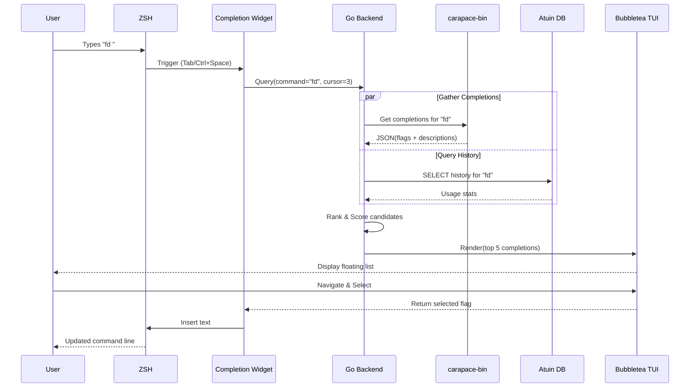
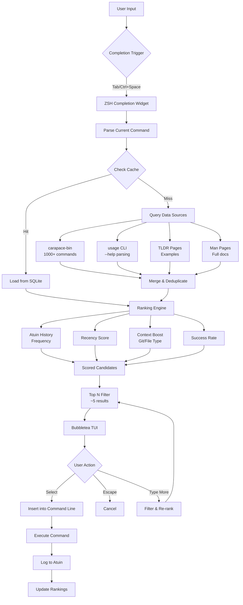
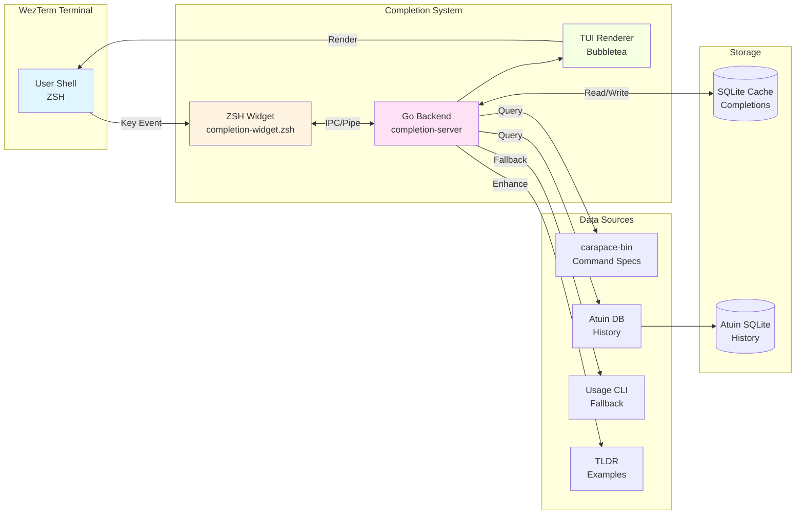
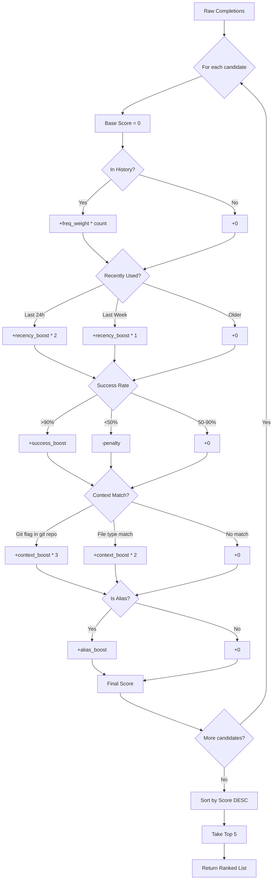

# WezTerm IDE-Style Completion System - Design Plan

## Overview

Build an IDE-like completion system for WezTerm that displays CLI argument information with descriptions, similar to Neovim's command completion or VSCode's IntelliSense for shell commands.

### Current State

Your environment already has:
- **WezTerm**: Custom tab management, git integration, process icons
- **ZSH**: Oh My ZSH with completions, autosuggestions, syntax highlighting
- **CLI Tools**: television (Ctrl+T context-aware), fzf, atuin (SQL history), zoxide
- **No WezTerm IDE completion display** - this is the gap to fill

---

## Design Goals

1. **Visual Display**: Show top ~5 completion candidates above the prompt
2. **Rich Information**: Flag names, short names, descriptions from multiple sources
3. **Smart Ranking**: Weight by frequency (history), recency, aliases, context
4. **Real-time Filtering**: Narrow suggestions as typing continues
5. **Multiple Data Sources**: Shell completions, man pages, TLDR, `usage` specs

---

## Architecture Approaches

### Approach 1: WezTerm Native Lua Integration ⭐ (Recommended)

**Architecture:**
```
User types → WezTerm captures input → Lua script queries completion backend
          → Renders completion UI in overlay pane/window
          → User selects → WezTerm injects text
```

**Components:**
- **WezTerm Lua Config** (`dot_wezterm.lua`): Handle key events, render UI
- **Completion Backend**: External process (Python/Go/Rust) that:
  - Parses completion sources
  - Ranks candidates
  - Returns structured data (JSON)
- **Data Cache**: SQLite DB or JSON cache for parsed completions

**Pros:**
- ✅ Deep WezTerm integration
- ✅ Can render rich UI (colors, borders, formatting)
- ✅ Access to terminal state (current command, cursor position)
- ✅ No shell-specific dependencies
- ✅ Can show completions above prompt without interference

**Cons:**
- ❌ Complex WezTerm Lua API learning curve
- ❌ Limited by WezTerm's rendering capabilities
- ❌ Requires spawning external process for each query
- ❌ May have input handling edge cases

**Implementation Complexity:** High
**Performance:** Good (with caching)
**Portability:** WezTerm-only

---

### Approach 2: ZSH Widget with External UI ⭐⭐ (Best Balance)

**Architecture:**
```
User types → ZSH captures via widget → Query completion backend
          → Backend returns candidates → ZSH widget calls external renderer
          → Renderer uses terminal control codes to draw UI above prompt
          → User selects → ZSH inserts text
```

**Components:**
- **ZSH Widget**: Custom completion function (like fzf-completion)
- **Completion Backend**: Standalone binary (Go/Rust recommended)
  - Parse all completion sources
  - Rank with ML-style scoring
  - Return JSON
- **UI Renderer**: Terminal UI library
  - Options: `bubbletea` (Go), `ratatui` (Rust), `textual` (Python)
  - Draws above prompt using ANSI escape codes
  - Handles input forwarding

**Pros:**
- ✅ Portable across terminals (not just WezTerm)
- ✅ Rich ecosystem of TUI libraries
- ✅ Can reuse existing ZSH completion infrastructure
- ✅ Easy to integrate with atuin history
- ✅ Mature widget development patterns (like fzf, zoxide)

**Cons:**
- ❌ Rendering may conflict with other ZSH widgets
- ❌ Complex terminal state management (save/restore cursor, etc.)
- ❌ ZSH-specific (won't work in bash/fish without ports)

**Implementation Complexity:** Medium-High
**Performance:** Excellent (native binaries)
**Portability:** Good (any terminal, but ZSH-only)

---

### Approach 3: LSP-Style Completion Server

**Architecture:**
```
Shell prompt → Completion client sends LSP-style request
           → Server parses command context, returns completions
           → Client renders in terminal or WezTerm overlay
```

**Components:**
- **Completion Server**: Long-running daemon (like language servers)
  - Implements custom protocol (or subset of LSP)
  - Watches for completion requests via socket/stdin
  - Pre-loads and indexes all completion data
- **Client**: Shell widget or WezTerm Lua script
- **Protocol**: JSON-RPC or custom lightweight protocol

**Pros:**
- ✅ Pre-loaded data = instant responses
- ✅ Language-agnostic client (works from any shell/terminal)
- ✅ Can update completion data in background
- ✅ Familiar pattern for developers

**Cons:**
- ❌ Requires daemon management (start/stop/restart)
- ❌ More complex protocol design
- ❌ Overkill for simple use case
- ❌ Resource overhead (always-running process)

**Implementation Complexity:** Very High
**Performance:** Excellent (pre-indexed)
**Portability:** Excellent

---

### Approach 4: Shell Completion Extension (Minimal)

**Architecture:**
```
User types → Shell's native completion system
          → Enhanced completion formatter
          → Pretty-print with descriptions in-place
```

**Components:**
- **ZSH Completion Functions**: Extended existing ones
- **Formatter**: Custom `zstyle` configurations for completion display
- **No External UI**: Uses ZSH's built-in menu completion

**Pros:**
- ✅ Simplest implementation
- ✅ No external dependencies
- ✅ Works with all existing completions
- ✅ Familiar ZSH patterns

**Cons:**
- ❌ Limited UI capabilities (no "floating" display above prompt)
- ❌ Harder to integrate smart ranking
- ❌ Description display limited by ZSH formatting
- ❌ Can't show "top 5" above prompt (only below)

**Implementation Complexity:** Low
**Performance:** Excellent
**Portability:** Good (ZSH-only)

---

## Data Source Integration

### 1. Shell Completions (ZSH)

**Parsing ZSH Completion Functions:**

ZSH stores completions in functions (e.g., `_fd`, `_git`, `_npm`). These are complex scripts that generate completions dynamically.

**Options:**
- **A. Direct Invocation**: Call ZSH completion functions, capture output
  - Command: `zsh -c "compdef -p; compdef"`
  - Parse `compadd` calls in completion functions
  - **Pro**: Accurate, uses existing definitions
  - **Con**: Slow, hard to parse dynamic behavior

- **B. Static Analysis**: Parse completion files
  - Location: `$(brew --prefix)/share/zsh/site-functions/`
  - Extract `_arguments` specifications
  - **Pro**: Fast, can pre-process
  - **Con**: Misses dynamic completions, complex to parse

- **C. Hybrid**: Cache static + invoke for dynamic
  - Pre-parse common tools
  - Fall back to invocation for dynamic commands
  - **Pro**: Best balance
  - **Con**: Complex caching logic

**Recommendation**: Hybrid approach with aggressive caching

---

### 2. Man Pages

**Parsing Options:**

**A. `mandoc` + Custom Parser:**
```bash
mandoc -Tmarkdown /path/to/manpage | parse-flags.py
```
- **Pro**: Structured output, widely available
- **Con**: Markdown format still needs parsing

**B. `tldr-pages/tldr` (TLDR Client):**
```bash
tldr --render fd
```
- Already have simplified, structured examples
- **Pro**: Simple, human-friendly
- **Con**: Limited coverage, no full flag list

**C. `cheat` / `navi` Integration:**
- You already use `navi` with widget integration
- **Pro**: Cheatsheet-based, easy to extend
- **Con**: Manual curation needed

**D. `man-to-md` or `pandoc`:**
```bash
pandoc -f man -t markdown /usr/share/man/man1/fd.1
```
- **Pro**: Clean markdown conversion
- **Con**: Still needs flag extraction

**E. Specialized Tools:**
- **`explainshell.com` parser**: Open source, parses man pages to JSON
- **`linux-man-pages-parser`**: Python library for parsing man pages
- **`help2man` output**: Generate from `--help`

**Recommendation**: Combine TLDR (for descriptions) + `--help` parsing (for comprehensive flags)

---

### 3. `--help` Output Parsing

**Tools:**

**A. `jdx/usage` ⭐⭐ (Recommended):**
```bash
usage --spec fd
```
- Parses `--help` output into structured spec
- Output format: JSON with flags, descriptions, types
- **Pro**: Standardized format, actively maintained, supports 1000+ CLIs
- **Con**: Requires `usage` to be installed

**Installation:**
```bash
mise install usage@latest
```

**Example output structure:**
```json
{
  "name": "fd",
  "flags": {
    "--hidden": {
      "short": "-H",
      "description": "Search hidden files and directories"
    },
    "--type": {
      "short": "-t",
      "description": "Filter by type",
      "arg": {
        "choices": ["f", "d", "l", "x", "e", "s"]
      }
    }
  },
  "args": [
    {
      "name": "pattern",
      "description": "the search pattern"
    }
  ]
}
```

**B. Custom `--help` Parser:**
- Regex-based extraction from `command --help`
- **Pro**: No dependencies
- **Con**: Brittle, varies by command

**C. `tealdeer` (Rust TLDR client):**
```bash
tldr --list | xargs -I {} tldr {}
```
- Fast, can cache all pages
- **Pro**: Comprehensive community docs
- **Con**: Not all commands covered

**Recommendation**: Use `usage` as primary source, fall back to manual parsing

---

### 4. TLDR Pages

**Integration:**

```bash
# Install tealdeer (Rust TLDR client)
mise install tldr@latest

# Update cache
tldr --update

# Query
tldr fd --raw
```

**Structure:**
```markdown
# fd

> Find files by name.

- Find files by pattern:
  `fd {{pattern}}`

- Find files with extension:
  `fd -e {{txt}}`
```

**Parsing:**
- Simple markdown format
- Extract examples → infer flags
- Complement with `usage` for full flag list

---

### 5. History & Ranking

**Data Sources:**

**A. Atuin (SQL History):**
```bash
atuin search --limit 1000 "fd " --format json
```

**Returns:**
```json
[
  {
    "command": "fd -e py",
    "timestamp": 1234567890,
    "duration": 123,
    "exit": 0
  }
]
```

**Metrics for Ranking:**
- **Frequency**: How often flag appears in history
- **Recency**: When last used
- **Success rate**: Commands with exit=0
- **Context**: Flags used together (co-occurrence)

**B. Shell Aliases:**
```bash
alias | grep "^fd"
```

**C. Z-score Ranking:**
```
score = (frequency_weight * freq) + (recency_weight * recency) + (success_weight * success)
```

**Recommendation**: Use atuin's SQL database directly for performance

---

## Completion Rendering Strategies

### Option A: WezTerm Overlay Pane

**API:**
```lua
wezterm.on('update-right-status', function(window, pane)
  -- Create floating overlay
  local overlay = pane:split({
    size = { Cells = 40 },
    direction = 'Top',
  })

  -- Render completions
  overlay:send_text(completion_ui)
end)
```

**Pros:**
- Native WezTerm integration
- Can position precisely above prompt
- Access to WezTerm events

**Cons:**
- Complex pane management
- May interfere with existing layout

---

### Option B: Terminal UI (ANSI Escape Codes)

**Libraries:**

**Go + Bubbletea:**
```go
import "github.com/charmbracelet/bubbletea"

type model struct {
    completions []Completion
    cursor      int
}

func (m model) View() string {
    // Render completion list
    // Use lipgloss for styling
}
```

**Rust + Ratatui:**
```rust
use ratatui::{Frame, Terminal};

fn render_completions(frame: &mut Frame, completions: &[Completion]) {
    // Render with rich formatting
}
```

**Python + Textual:**
```python
from textual.app import App
from textual.widgets import DataTable

class CompletionUI(App):
    def compose(self):
        yield DataTable()
```

**Pros:**
- Rich TUI capabilities
- Mature libraries
- Portable across terminals

**Cons:**
- Complex cursor/screen state management
- Need to save/restore terminal state

---

### Option C: Inline (ZSH Menu Completion)

**Configuration:**
```bash
zstyle ':completion:*' menu select
zstyle ':completion:*' format '%F{blue}-- %d --%f'
zstyle ':completion:*:descriptions' format '%U%B%d%b%u'
zstyle ':completion:*' list-colors ${(s.:.)LS_COLORS}
```

**Pros:**
- Simple, works everywhere
- No external dependencies

**Cons:**
- Limited formatting
- Can't float above prompt

---

## Recommended Implementation Plan

### Phase 1: Minimal Viable Product (1-2 weeks)

**Goal**: Basic completion display with descriptions

**Components:**
1. **ZSH Widget** (`~/.config/my_config/completion-widget.zsh`):
   - Bind to Tab or Ctrl+Space
   - Capture current command context
   - Call completion backend
   - Display results with simple menu

2. **Completion Backend** (Go binary using `jdx/usage`):
   ```
   completion-server query "fd " --cursor 3
   ```
   - Parse with `usage`
   - Return JSON with flags + descriptions
   - No ranking yet (alphabetical)

3. **Simple TUI** (Go + Bubbletea):
   - Show top 5 completions
   - Arrow keys to navigate
   - Enter to accept

**Data Sources**: `usage` only

---

### Phase 2: Smart Ranking (2-3 weeks)

**Enhancements:**
1. **History Integration**:
   - Query atuin SQLite database
   - Calculate frequency/recency scores
   - Boost commonly used flags

2. **Caching Layer**:
   - SQLite cache for parsed completions
   - Update cache on tool version changes
   - TTL-based invalidation

3. **Context Awareness**:
   - Detect current git repo
   - Boost git-related flags in git repos
   - Detect file types, suggest relevant flags

---

### Phase 3: Multi-Source Integration (3-4 weeks)

**Add:**
1. **TLDR Pages**: Supplement descriptions
2. **Man Page Parsing**: Fall back for tools without `usage` specs
3. **ZSH Completion Functions**: Dynamic completions for complex tools
4. **Alias Integration**: Show user's aliases in suggestions

---

### Phase 4: WezTerm Native UI (4-5 weeks)

**Migrate from TUI to WezTerm Lua:**
1. **Overlay Rendering**: Float completion window above prompt
2. **Rich Formatting**: Colors, borders, icons
3. **Key Event Handling**: Direct WezTerm key binding
4. **Inline Documentation**: Show full man page excerpt on hover

---

## Technology Stack Recommendations

### Backend Language: **Go** ⭐⭐

**Why:**
- Fast compilation and execution
- Excellent CLI libraries (cobra, bubbletea)
- Easy to call external tools (`usage`, `tldr`)
- Single binary distribution
- Great concurrency for parallel parsing

**Alternatives:**
- **Rust**: Faster, but longer compile times, steeper learning curve
- **Python**: Easier to prototype, but slower and requires interpreter

---

### UI Library: **Bubbletea** (Go) ⭐⭐

**Why:**
- Modern TUI framework (Elm architecture)
- Great styling with Lipgloss
- Active development
- Examples: `glow`, `soft-serve`, `vhs`

**Alternatives:**
- **Ratatui** (Rust): More mature, but Rust complexity
- **Textual** (Python): Excellent DX, but Python overhead

---

### Storage: **SQLite**

**Schema:**
```sql
CREATE TABLE completions (
    command TEXT PRIMARY KEY,
    spec JSON,  -- Full usage spec
    updated_at TIMESTAMP
);

CREATE TABLE history_stats (
    command TEXT,
    flag TEXT,
    frequency INTEGER,
    last_used TIMESTAMP,
    avg_duration_ms INTEGER,
    success_rate REAL
);
```

---

### Integration Points

1. **ZSH Widget**: `~/.config/my_config/completion-widget.zsh`
2. **Backend Binary**: `~/.local/bin/completion-server`
3. **Cache**: `~/.cache/completion-cache.db`
4. **WezTerm Config**: `~/.wezterm.lua` (Phase 4)

---

## Alternative: Leverage Existing Tools

### Use `carapace-bin` ⭐

**What is it:**
- Universal completion engine
- 1000+ command specs in structured format
- Can generate completions for multiple shells
- Actively maintained

**Integration:**
```bash
mise install carapace@latest

# Generate completions
carapace fd --json
```

**Output:**
```json
{
  "Completion": [
    {
      "Value": "--hidden",
      "Display": "-H, --hidden",
      "Description": "Search hidden files and directories",
      "Style": "blue"
    }
  ]
}
```

**Pros:**
- ✅ Pre-built specs for 1000+ commands
- ✅ JSON output ready to consume
- ✅ Active community
- ✅ Can contribute custom specs

**Cons:**
- ❌ Still need custom ranking and UI
- ❌ May not cover all your custom tools

**Recommendation**: Use as primary data source instead of `usage`

---

## Tradeoff Matrix

| Approach | Complexity | Performance | Features | Portability |
|----------|------------|-------------|----------|-------------|
| **WezTerm Native** | High | Good | Rich UI | WezTerm-only |
| **ZSH Widget + TUI** | Medium | Excellent | Good UI | Any terminal, ZSH-only |
| **LSP Server** | Very High | Excellent | Extensible | Excellent |
| **Enhanced ZSH Completion** | Low | Excellent | Basic | ZSH-only |

| Data Source | Coverage | Accuracy | Maintenance |
|-------------|----------|----------|-------------|
| **`jdx/usage`** | High | Good | Auto-parsed |
| **`carapace-bin`** | Very High | Excellent | Community |
| **ZSH Completions** | High | Excellent | Existing |
| **Man Pages** | Universal | Varies | Manual parsing |
| **TLDR** | Medium | Good | Community |

---

## Final Recommendation

### **Hybrid Approach: ZSH Widget + Carapace + Bubbletea**

**Why:**
1. **Best Balance**: Medium complexity, excellent performance
2. **Data Source**: `carapace-bin` for 1000+ command specs (JSON)
3. **Ranking**: Atuin history + frequency analysis
4. **UI**: Bubbletea (Go) for rich TUI
5. **Integration**: ZSH widget (works in any terminal)
6. **Future**: Migrate to WezTerm native when ready

**Architecture:**
```
User types "fd " → ZSH widget captures
                → Go binary queries:
                  1. carapace-bin for completions
                  2. atuin DB for history
                  3. Ranks and scores
                → Bubbletea renders TUI
                → User selects
                → ZSH inserts
```

**Timeline:**
- **Week 1-2**: ZSH widget + Go binary + carapace integration
- **Week 3-4**: Bubbletea TUI + basic ranking
- **Week 5-6**: Atuin integration + smart ranking
- **Week 7+**: Polish, caching, WezTerm migration

---

## Mermaid Diagrams

### System Architecture Flow



---

### Data Flow Architecture



---

### Component Architecture



---

### Ranking Algorithm Flow



---

## Next Steps

1. **Prototype Decision**: Choose between:
   - **Quick Win**: Enhance existing ZSH completion with better formatting
   - **Full Build**: Go + carapace + Bubbletea implementation

2. **Data Source**: Install and test `carapace-bin`:
   ```bash
   mise install carapace@latest
   carapace fd --json
   ```

3. **ZSH Widget**: Create basic widget that calls external binary

4. **Iterate**: Start minimal, add features incrementally

Would you like me to start with a specific approach, or would you prefer to prototype the minimal ZSH enhancement first?
