# Jujutsu Decision Trees: What Command Should I Use?

This document provides decision trees to help you choose the right jj command for your situation.

## Table of Contents

- [Starting New Work](#starting-new-work)
- [Making Changes](#making-changes)
- [Organizing Your Work](#organizing-your-work)
- [Fixing Mistakes](#fixing-mistakes)
- [Sharing Your Work](#sharing-your-work)
- [Syncing with Remote](#syncing-with-remote)
- [Navigating History](#navigating-history)

---

## Starting New Work

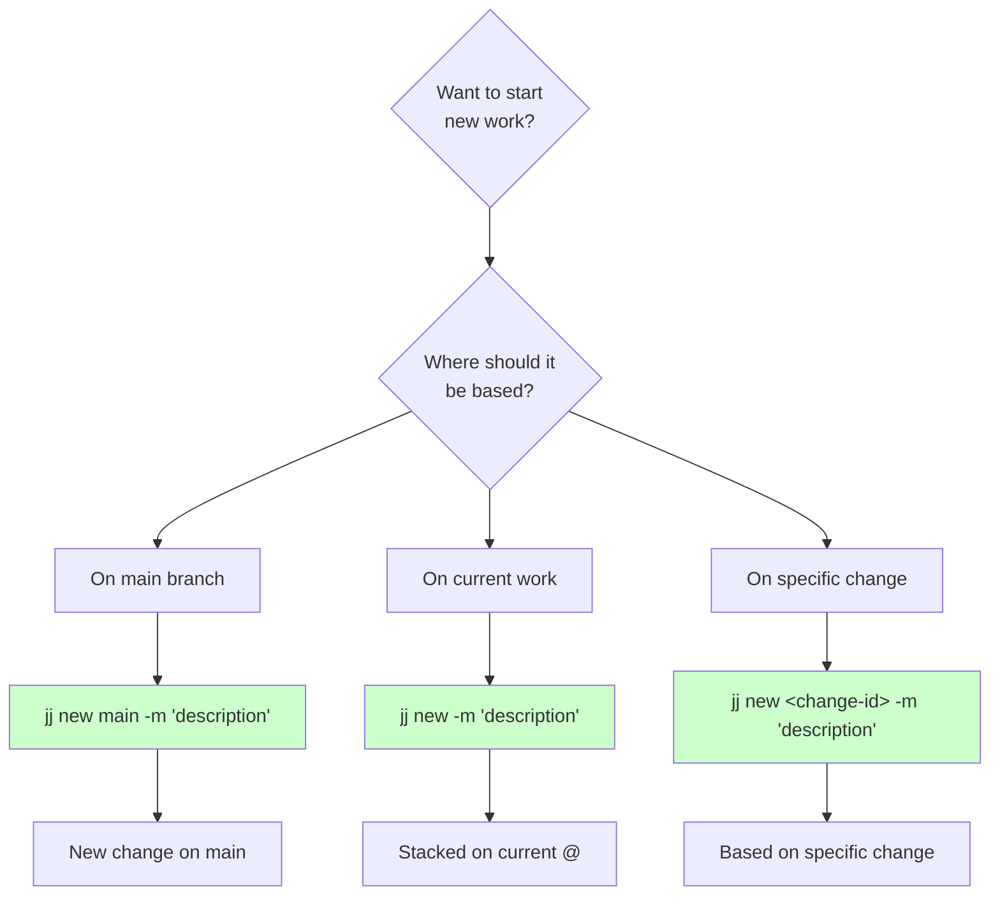

### Quick Reference

| Scenario | Command | Result |
|----------|---------|--------|
| Independent work from main | `jj new main -m "msg"` | New change based on main |
| Continue current work | `jj new -m "msg"` | Stack on current @ |
| Branch from specific change | `jj new <id> -m "msg"` | Base on that change |

---

## Making Changes

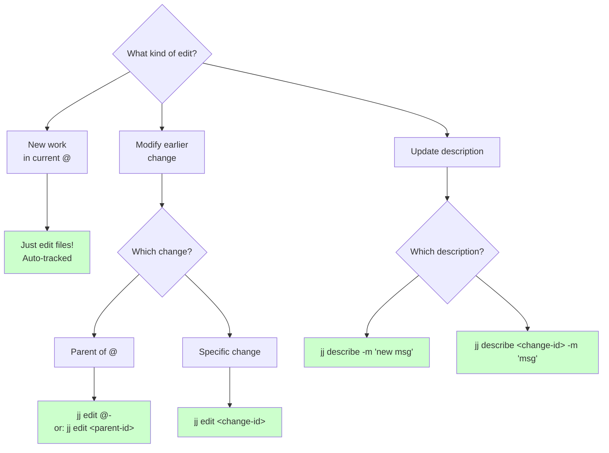

### Quick Reference

| Scenario | Command | Notes |
|----------|---------|-------|
| Edit files in current change | Just edit! | Auto-tracked |
| Edit parent change | `jj edit @-` | Switch @ to parent |
| Edit specific change | `jj edit <id>` | Switch @ to that change |
| Update current description | `jj describe -m "msg"` | Can run multiple times |
| Update old description | `jj describe <id> -m "msg"` | No rebase needed |

---

## Organizing Your Work

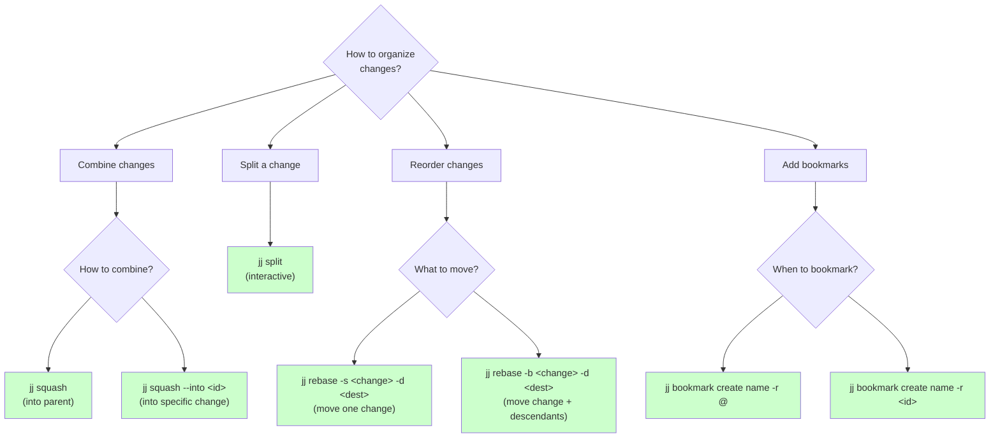

### Squashing Examples

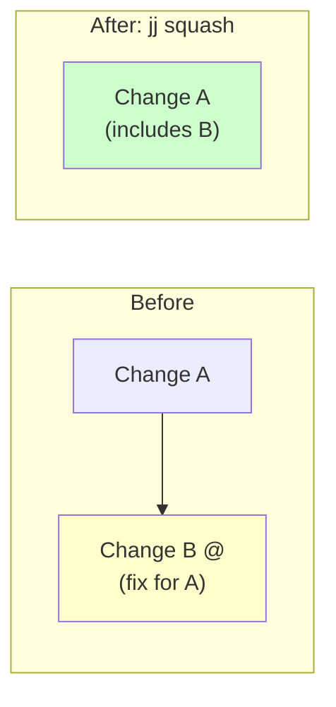

### Quick Reference

| Scenario | Command | Notes |
|----------|---------|-------|
| Merge @ into parent | `jj squash` | Current → parent |
| Merge @ into specific | `jj squash --into <id>` | Current → specific |
| Split current change | `jj split` | Interactive split |
| Move single change | `jj rebase -s <id> -d <dest>` | Only that change |
| Move change + children | `jj rebase -b <id> -d <dest>` | Entire subtree |
| Bookmark current | `jj bookmark create name -r @` | On @ |
| Bookmark specific | `jj bookmark create name -r <id>` | On any change |

---

## Fixing Mistakes

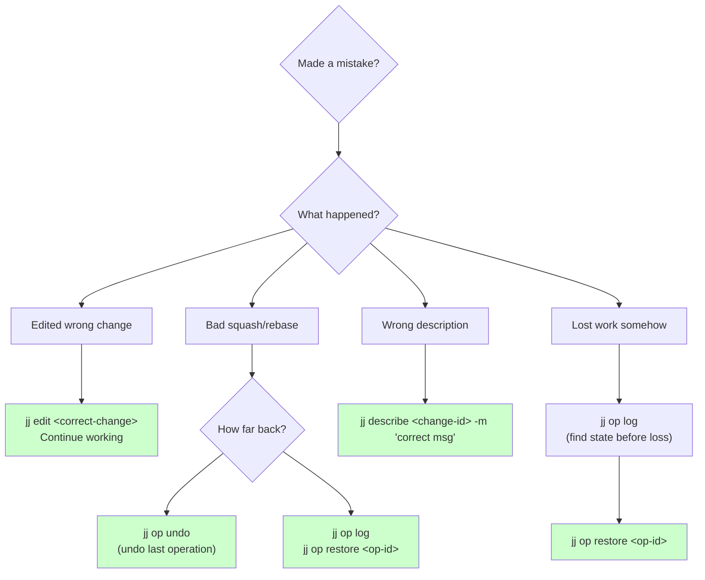

### Operation Log Safety Net

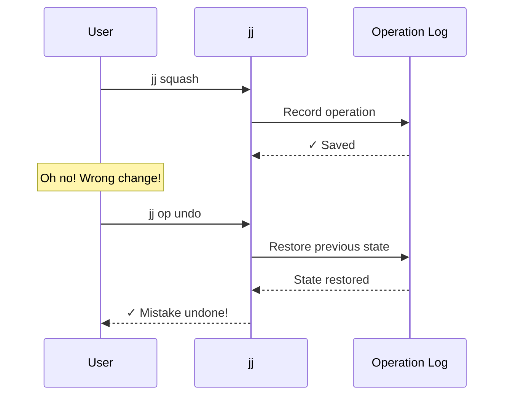

### Quick Reference

| Scenario | Command | Notes |
|----------|---------|-------|
| Undo last operation | `jj op undo` | Reverses last op |
| View operation history | `jj op log` | See all operations |
| Restore to specific point | `jj op restore <op-id>` | Time travel |
| Fix wrong description | `jj describe <id> -m "msg"` | Update any change |
| Switch to different change | `jj edit <id>` | Move @ |

---

## Sharing Your Work

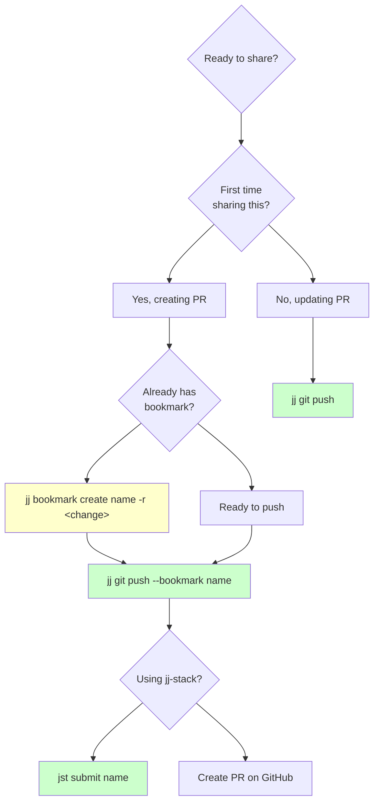

### Stacked PRs Decision

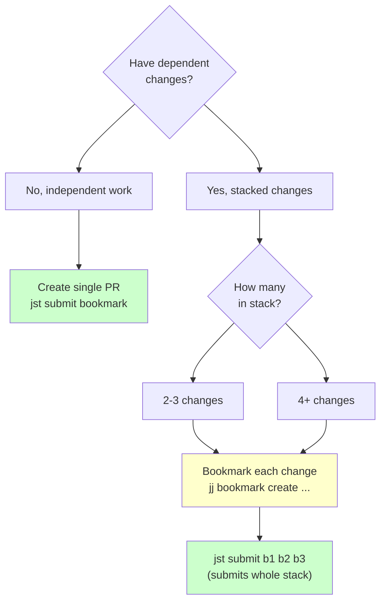

### Quick Reference

| Scenario | Command | Notes |
|----------|---------|-------|
| Create bookmark | `jj bookmark create name -r <id>` | Needed for PRs |
| Push bookmark first time | `jj git push --bookmark name` | Or use jst |
| Update existing PR | `jj git push` | Push changes |
| Submit with jj-stack | `jst submit bookmark` | Creates/updates PR |
| Submit stack | `jst submit b1 b2 b3` | Multiple dependent PRs |

---

## Syncing with Remote

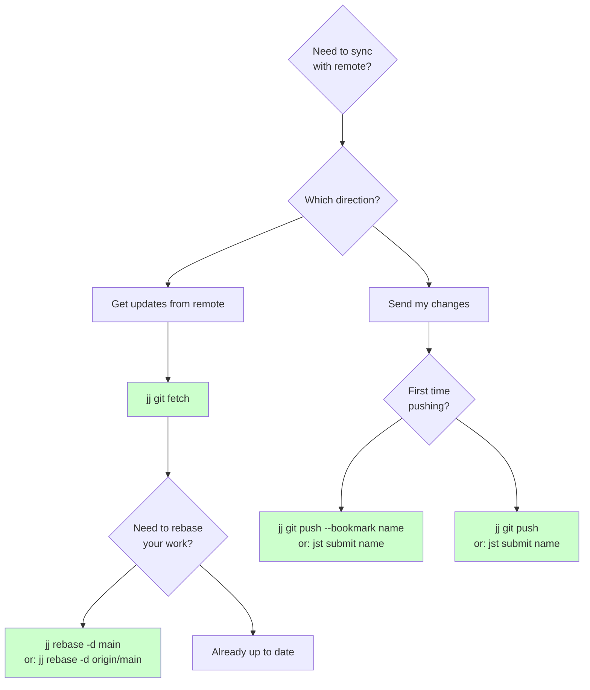

### After PR Merge Workflow

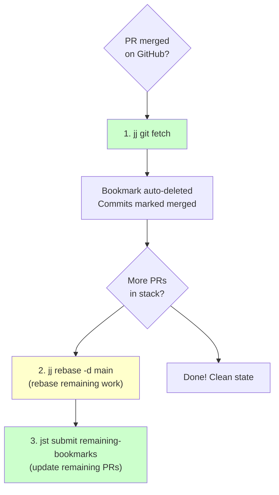

### Quick Reference

| Scenario | Command | Notes |
|----------|---------|-------|
| Get remote updates | `jj git fetch` | Fetch all remotes |
| Rebase onto main | `jj rebase -d main` | Update your work |
| Push new bookmark | `jj git push --bookmark name` | First push |
| Update existing | `jj git push` | Subsequent pushes |
| After PR merge | `jj git fetch && jj rebase -d main` | Clean up |

---

## Navigating History

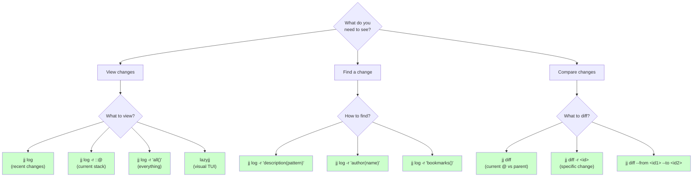

### Revset Query Examples

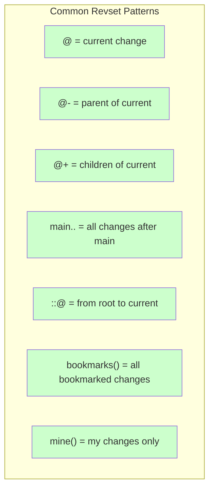

### Quick Reference

| Scenario | Command | Notes |
|----------|---------|-------|
| View recent changes | `jj log` | Last ~10 changes |
| View current stack | `jj log -r ::@` | Root to @ |
| View all changes | `jj log -r 'all()'` | Everything |
| Visual interface | `lazyjj` | Interactive TUI |
| Search by description | `jj log -r 'description("text")'` | Pattern match |
| Your bookmarks only | `jj log -r 'bookmarks() & mine()'` | Filter |
| Diff current | `jj diff` | @ vs parent |
| Diff specific | `jj diff -r <id>` | Change vs parent |
| Diff two changes | `jj diff --from <id1> --to <id2>` | Compare any two |

---

## Decision Matrix: Common Scenarios

### Scenario: I want to...

```mermaid
graph TD
    SCENARIO["Common Scenarios:<br/>Quick Command Lookup"]

    SCENARIO --> S1["Start new work"] --> C1["jj new main -m 'msg'"]
    SCENARIO --> S2["Continue current work"] --> C2["jj new -m 'msg'"]
    SCENARIO --> S3["Edit an old change"] --> C3["jj edit &lt;id&gt;"]
    SCENARIO --> S4["Update description"] --> C4["jj describe -m 'msg'"]
    SCENARIO --> S5["Combine two changes"] --> C5["jj squash --into &lt;id&gt;"]
    SCENARIO --> S6["Split a change"] --> C6["jj split"]
    SCENARIO --> S7["Undo a mistake"] --> C7["jj op undo"]
    SCENARIO --> S8["View my stack"] --> C8["jj log -r ::@"]
    SCENARIO --> S9["Sync with remote"] --> C9["jj git fetch"]
    SCENARIO --> S10["Push to GitHub"] --> C10["jst submit bookmark"]
    SCENARIO --> S11["Rebase on main"] --> C11["jj rebase -d main"]
    SCENARIO --> S12["Create a bookmark"] --> C12["jj bookmark create name"]

    style C1 fill:#ccffcc
    style C2 fill:#ccffcc
    style C3 fill:#ccffcc
    style C4 fill:#ccffcc
    style C5 fill:#ccffcc
    style C6 fill:#ccffcc
    style C7 fill:#ccffcc
    style C8 fill:#ccffcc
    style C9 fill:#ccffcc
    style C10 fill:#ccffcc
    style C11 fill:#ccffcc
    style C12 fill:#ccffcc
```

---

## When to Use What: Quick Guide

### Creating Changes

| Goal | Command | When |
|------|---------|------|
| New independent work | `jj new main -m "msg"` | Starting fresh feature |
| Stack on current | `jj new -m "msg"` | Building on current work |
| Branch from specific point | `jj new <id> -m "msg"` | Base on older change |

### Editing

| Goal | Command | When |
|------|---------|------|
| Edit files | Just edit! | Modifying @ |
| Switch to different change | `jj edit <id>` | Work on older change |
| Update description | `jj describe -m "msg"` | Fix commit message |

### Organizing

| Goal | Command | When |
|------|---------|------|
| Merge into parent | `jj squash` | Fix belongs in parent |
| Merge into specific | `jj squash --into <id>` | Fix belongs elsewhere |
| Split change | `jj split` | Change does too much |
| Reorder | `jj rebase -s <id> -d <dest>` | Change in wrong place |

### Sharing

| Goal | Command | When |
|------|---------|------|
| Create bookmark | `jj bookmark create name` | Preparing to push |
| Push to GitHub | `jst submit bookmark` | Create/update PR |
| Push stack | `jst submit b1 b2 b3` | Multiple dependent PRs |

### Syncing

| Goal | Command | When |
|------|---------|------|
| Get updates | `jj git fetch` | Sync with remote |
| Update your work | `jj rebase -d main` | After fetch |
| After PR merge | `jj git fetch && jj rebase -d main` | Clean up |

---

## Summary Decision Tree

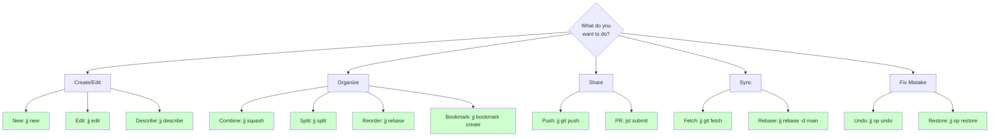

---

## Further Reading

- [JJ_MENTAL_MODEL.md](./JJ_MENTAL_MODEL.md) - Core concepts and data structures
- [JJ_WORKFLOWS.md](./JJ_WORKFLOWS.md) - Common workflow patterns
- [JJ_STACKED_WORKFLOW.md](./JJ_STACKED_WORKFLOW.md) - jj-stack specific workflows
- [jj Official Docs](https://jj-vcs.github.io/jj/) - Command reference

**Tip**: When in doubt, remember: jj operations are tracked and can be undone with `jj op undo`!
