# Jujutsu Mental Model: Core Concepts

This document explains the fundamental concepts and data structures in Jujutsu (jj) through visual diagrams.

## Table of Contents

- [Changes vs Commits](#changes-vs-commits)
- [Git vs jj Mental Models](#git-vs-jj-mental-models)
- [The Working Copy](#the-working-copy)
- [Identifiers: Change ID vs Commit ID](#identifiers-change-id-vs-commit-id)
- [The Operation Log](#the-operation-log)
- [Bookmarks vs Branches](#bookmarks-vs-branches)

---

## Changes vs Commits

> "The biggest difference between jj and git is that git revolves around commits as the main unit of change, while jj revolves around changesets."
>
> — [Jujutsu VCS Overview](https://levelup.gitconnected.com/jujutsu-vcs-a-git-compatible-revolution-in-version-control-620f9d3306fe)

### Key Distinction

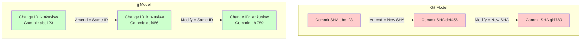

**Git**: Commits are immutable. Any modification creates a new commit with a new SHA.

**jj**: Changes are mutable. The Change ID stays constant while the underlying commit SHA evolves.

### What This Means

| Concept | Git | Jujutsu |
|---------|-----|---------|
| **Fundamental Unit** | Commit (immutable snapshot) | Change (mutable logical unit) |
| **Identity** | SHA hash (content-based) | Change ID (stable across edits) |
| **Modification** | Creates new commit | Updates existing change |
| **History Tracking** | Compare commit SHAs | Track evolution via `jj evolog` |

> "A change, not a commit, is the fundamental element of the mental and working model. That means that you can describe a change that is still 'in progress' as it were."
>
> — [Chris Krycho: jj init](https://v5.chriskrycho.com/essays/jj-init/)

---

## Git vs jj Mental Models

### Git's Three-Stage Architecture

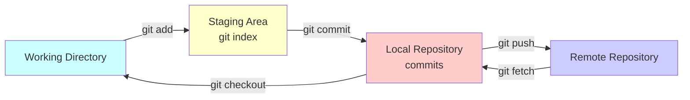

### jj's Unified Model

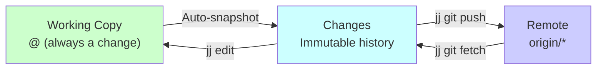

### Key Differences

| Aspect | Git | Jujutsu |
|--------|-----|---------|
| **Staging** | Explicit `git add` required | No staging - changes auto-tracked |
| **Working State** | Outside version control until added | Always inside a change (`@`) |
| **Stash** | Separate `git stash` mechanism | No stash needed - just switch changes |
| **Amend** | Special operation (`--amend`) | Natural operation (`jj describe`) |
| **Uncommitted Work** | Fragile, can be lost | Protected by operation log |

> "You are always inside a commit. Nothing exists outside commits—this eliminates stashing entirely and enables seamless context switching."
>
> — [Stavros: Switch to Jujutsu Already](https://www.stavros.io/posts/switch-to-jujutsu-already-a-tutorial/)

---

## The Working Copy

### Git's Working Directory

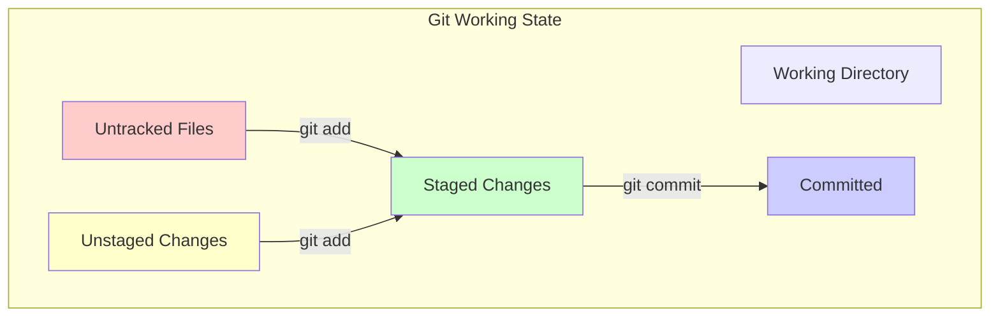

### jj's Working Copy (`@`)

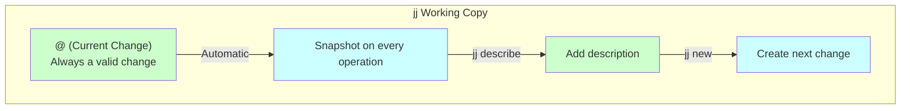

**Key Insight**: In jj, you're always working inside a change. The symbol `@` represents your current working copy change.

> "The basic jj workflow goes something like this: You create a new change, You modify files in your working tree, There is no step 3."
>
> — [Getting Started with Jujutsu](https://jj-tutorial.github.io/tutorial/core-concepts/changes-commits-and-revisions.html)

### Workflow Comparison

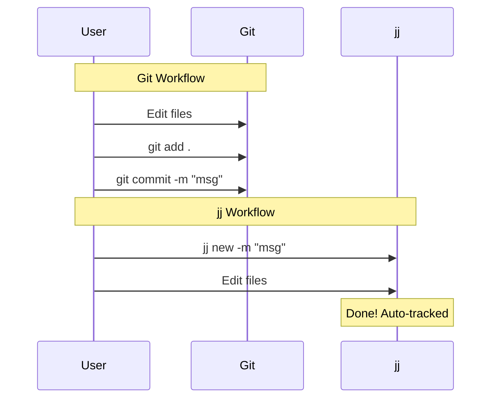

---

## Identifiers: Change ID vs Commit ID

Every change in jj has TWO identifiers:

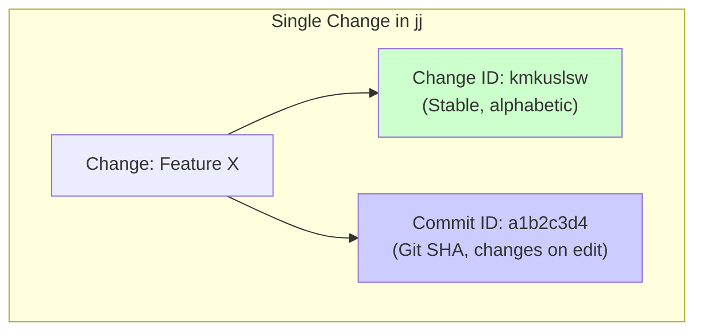

### How They Work

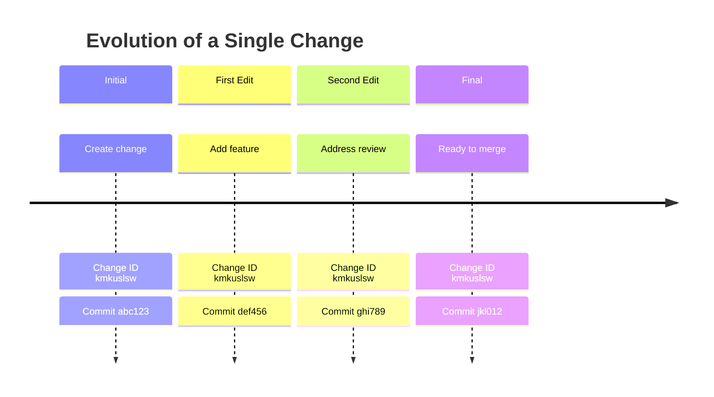

### Viewing IDs

When you run `jj log`:

```
@  kmkuslsw kyle@example.com 2025-01-23 10:23:45 feature-x abc123de
│  Add new feature X
○  rpqostuw kyle@example.com 2025-01-22 15:10:32 main def456gh
│  Previous work
```

**Left side** (kmkuslsw): Change ID - stays constant

**Right side** (abc123de): Commit ID - changes with edits

> "When you run `jj st`, you see both identifiers: Left side: change IDs (purely letters, excluding a-f), Right side: commit IDs (hexadecimal)"
>
> — [Getting Started with Jujutsu](https://jj-tutorial.github.io/tutorial/core-concepts/changes-commits-and-revisions.html)

### Why Two IDs?

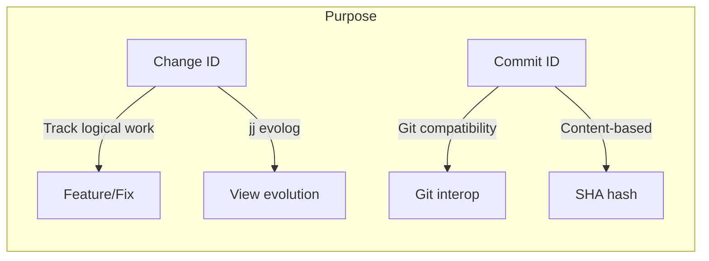

**Change ID**: For tracking your work through iterations

**Commit ID**: For Git compatibility and content verification

---

## The Operation Log

One of jj's most powerful features is tracking **every operation**, not just commits.

### Git's Reflog

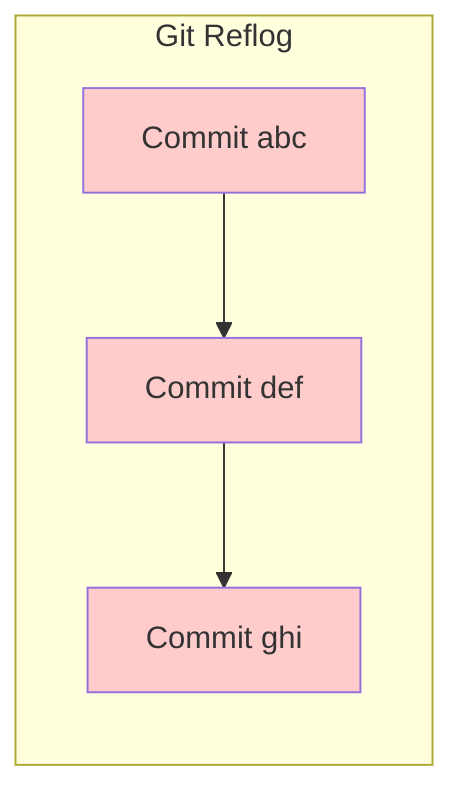

Only tracks commit operations on branches.

### jj's Operation Log

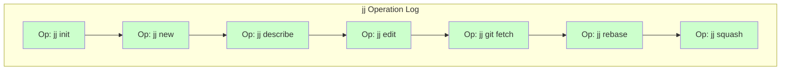

Tracks **every operation** including fetches, status checks, and failed operations.

### Why This Matters

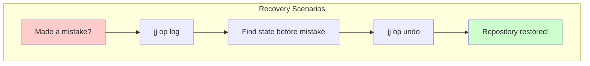

**Example**: Accidentally squashed the wrong commit?

```bash
jj op log              # See all operations
jj op undo             # Undo last operation
# Or restore to specific operation
jj op restore <op-id>
```

> "jj op log is much more useful and powerful than git reflog because it captures every action including status checks and fetches. This creates a comprehensive audit trail."
>
> — [Chris Krycho: jj init](https://v5.chriskrycho.com/essays/jj-init/)

### Operation Log Structure

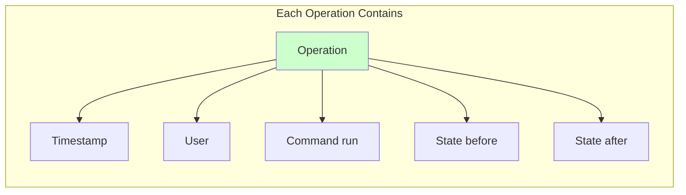

---

## Bookmarks vs Branches

In jj, what Git calls "branches" are called "bookmarks" to emphasize their role as movable pointers.

### Git Branches

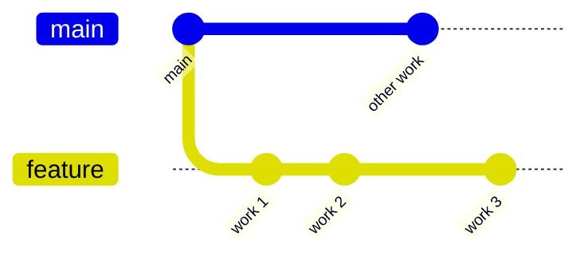

Branches are central to Git workflows.

### jj Bookmarks

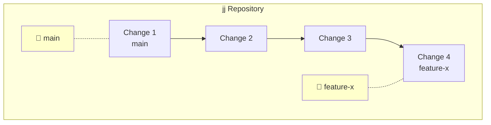

### Key Differences

| Concept | Git | Jujutsu |
|---------|-----|---------|
| **Name** | Branches | Bookmarks |
| **Required?** | Often required | Optional - changes exist independently |
| **Creation** | `git checkout -b` | `jj bookmark create` |
| **Anonymous Work** | Detached HEAD state | Natural - work without bookmark |
| **Primary Unit** | Branch | Change |

> "Branches require no explicit naming in Jujutsu. Creating multiple commit paths happens naturally."
>
> — [Stavros: Switch to Jujutsu Already](https://www.stavros.io/posts/switch-to-jujutsu-already-a-tutorial/)

### Anonymous Changes

In jj, you can create entire workflows without bookmarks:

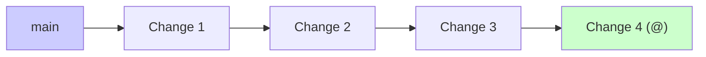

No bookmarks needed! Create them only when pushing to GitHub.

### Bookmark Lifecycle

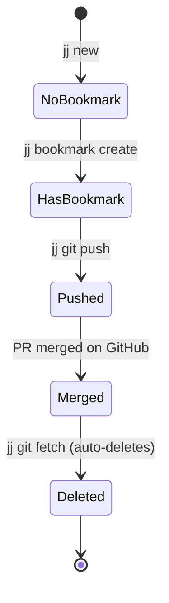

---

## Summary: The jj Mental Model

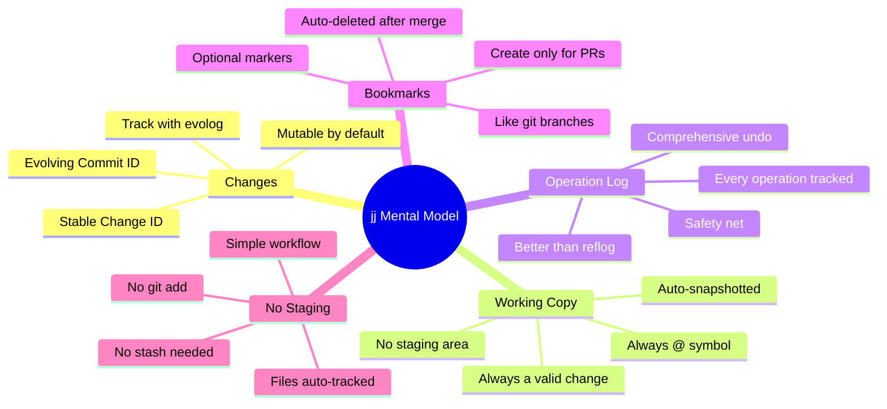

### Core Principles

1. **Everything is a change**: Not just commits, but work-in-progress too
2. **Changes are mutable**: Edit, describe, squash freely
3. **No staging area**: Files are automatically tracked
4. **Always in a change**: Working copy is always `@`
5. **Operation log safety**: Every operation can be undone
6. **Bookmarks are optional**: Use them only for PRs/sharing

### Philosophical Shift

> "While Git treats commits as immutable objects frozen after creation, Jujutsu embraces a 'Play-Doh' approach where commits themselves are also the object of manipulation."
>
> — [Stavros: Switch to Jujutsu Already](https://www.stavros.io/posts/switch-to-jujutsu-already-a-tutorial/)

---

## Further Reading

- [Getting Started with Jujutsu](https://jj-tutorial.github.io/tutorial/core-concepts/changes-commits-and-revisions.html) - Core concepts explained
- [Steve's Jujutsu Tutorial](https://steveklabnik.github.io/jujutsu-tutorial/) - Beginner-friendly guide
- [Chris Krycho: jj init](https://v5.chriskrycho.com/essays/jj-init/) - Deep dive into mental models
- [Stavros: Switch to Jujutsu Already](https://www.stavros.io/posts/switch-to-jujutsu-already-a-tutorial/) - Practical workflow guide

**Next**: See [JJ_WORKFLOWS.md](./JJ_WORKFLOWS.md) for visual workflow diagrams and [JJ_DECISION_TREES.md](./JJ_DECISION_TREES.md) for decision-making guides.
