# Stacked Diffs Workflow with jj-stack

This document visualizes how jj-stack manages stacked pull requests on GitHub.

## Table of Contents

- [What are Stacked Diffs?](#what-are-stacked-diffs)
- [jj-stack Architecture](#jj-stack-architecture)
- [Creating a Stack](#creating-a-stack)
- [jj-stack PR Creation Logic](#jj-stack-pr-creation-logic)
- [Managing Stack Updates](#managing-stack-updates)
- [After PR Merges](#after-pr-merges)
- [Advanced Stack Patterns](#advanced-stack-patterns)

---

## What are Stacked Diffs?

### Traditional Git Workflow

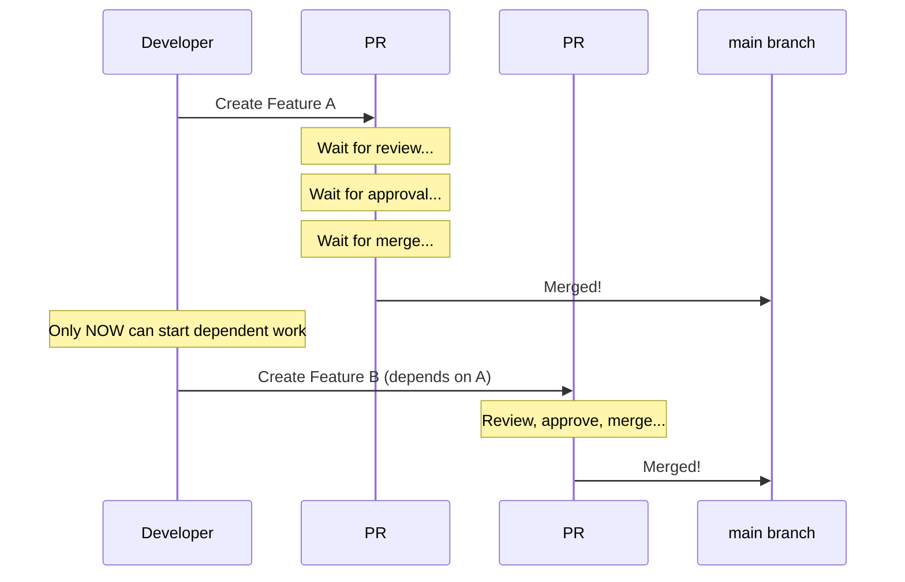

**Problem**: Sequential development. Feature B must wait for Feature A to merge.

### Stacked Diffs Workflow

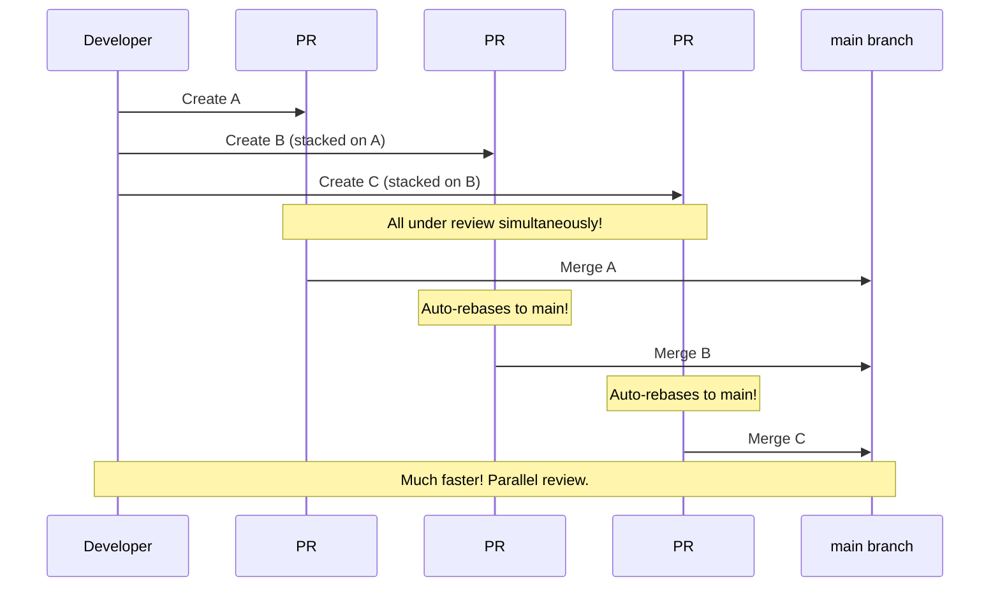

**Benefit**: Parallel development and review of dependent changes.

> "Stacked PRs are straight-up easy with jj. When someone requests changes to the first link in a chain of PRs, you can make changes, fix any conflicts higher up, and when you push, all PRs are updated."
>
> — [Community Discussion](https://github.com/jj-vcs/jj/discussions/5509)

---

## jj-stack Architecture

### How jj-stack Works

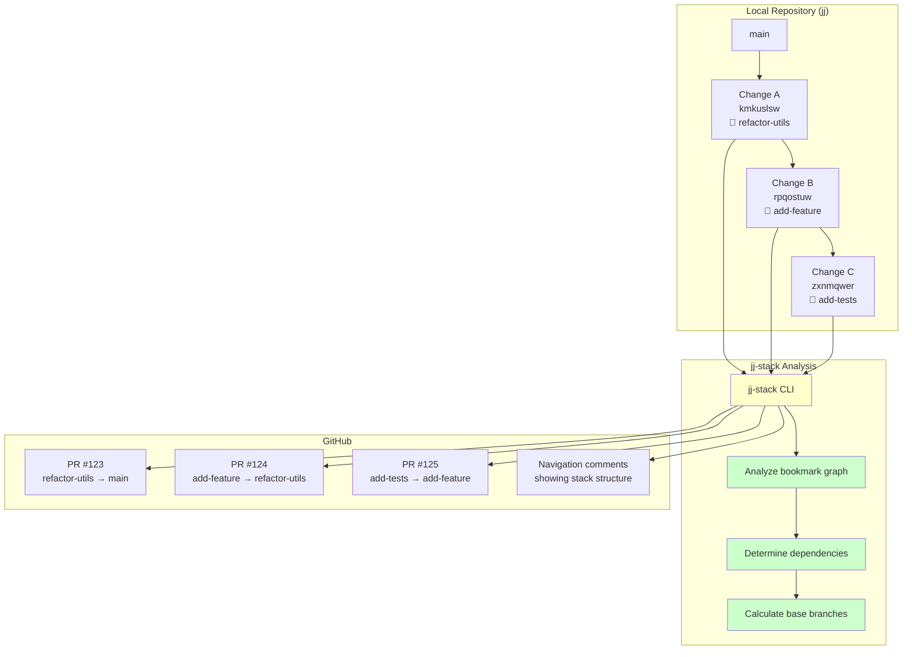

### Key Components

1. **Local Changes**: Regular jj changes with bookmarks
2. **jj-stack**: Analyzes bookmark relationships
3. **GitHub PRs**: Created with correct base branches
4. **Navigation**: Comments added to show stack hierarchy

---

## Creating a Stack

### Step-by-Step Visual

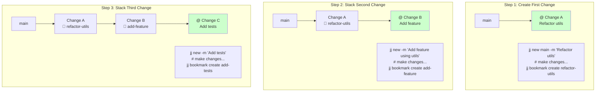

### Commands

```bash
# 1. Create first change
jj new main -m "Refactor utility functions"
# ... edit files ...
jj bookmark create refactor-utils -r @

# 2. Stack second change
jj new -m "Add feature using refactored utils"
# ... edit files ...
jj bookmark create add-feature -r @

# 3. Stack third change
jj new -m "Add comprehensive tests"
# ... edit files ...
jj bookmark create add-tests -r @

# View your stack
jj log -r ::@
```

**Output**:

```
@  zxnmqwer kyle 2m add-tests abc123de
│  Add comprehensive tests
○  rpqostuw kyle 15m add-feature def456gh
│  Add feature using refactored utils
○  kmkuslsw kyle 1h refactor-utils ghi789jk
│  Refactor utility functions
○  main
```

---

## jj-stack PR Creation Logic

### How jj-stack Determines Base Branches

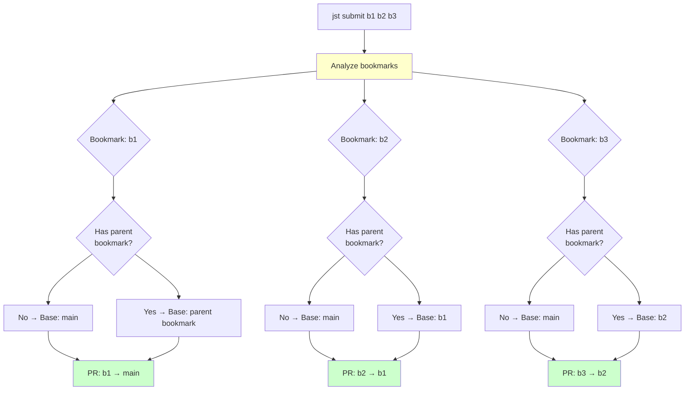

### Example: Submit Command

```bash
jst submit refactor-utils add-feature add-tests
```

**jj-stack's logic**:

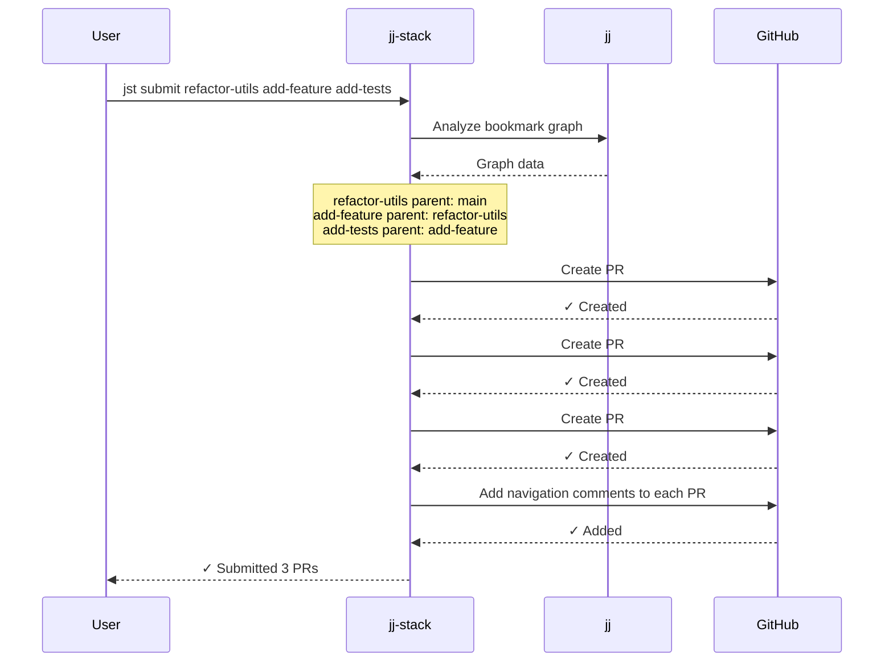

### GitHub PR Structure

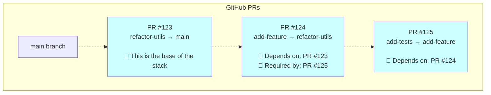

**Navigation comments** help reviewers understand the stack structure.

---

## Managing Stack Updates

### Scenario: Update Middle of Stack

```mermaid
graph TB
    subgraph "Before: Update Change A"
        M1[main]
        A1["Change A<br/>📌 refactor-utils<br/>❌ Review comments"]
        B1["Change B<br/>📌 add-feature"]
        C1["Change C<br/>📌 add-tests"]

        M1 --> A1
        A1 --> B1
        B1 --> C1
    end

    subgraph "Edit Change A"
        CMD["jj edit &lt;change-A-id&gt;<br/># make changes...<br/># Changes auto-tracked"]
    end

    subgraph "After: Automatically Rebased"
        M2[main]
        A2["Change A ✓<br/>📌 refactor-utils<br/>(updated)"]
        B2["Change B ✓<br/>📌 add-feature<br/>(auto-rebased)"]
        C2["Change C ✓<br/>📌 add-tests<br/>(auto-rebased)"]

        M2 --> A2
        A2 --> B2
        B2 --> C2
    end

    subgraph "Push Updates"
        PUSH["jst submit refactor-utils add-feature add-tests"]
    end

    style A1 fill:#ffcccc
    style A2 fill:#ccffcc
    style B2 fill:#ccffcc
    style C2 fill:#ccffcc
```

### Workflow

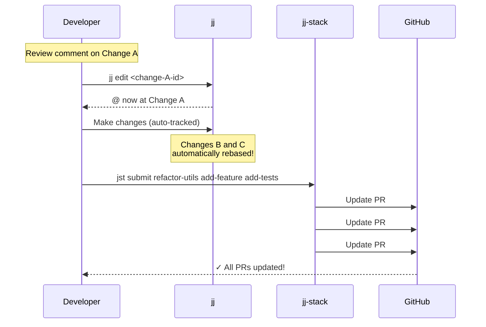

**Commands**:

```bash
# 1. Edit the change that needs updates
jj edit <change-A-id>
# or: jj edit refactor-utils~  (bookmark's change)

# 2. Make your changes
# Files are auto-tracked

# 3. Update all PRs
jst submit refactor-utils add-feature add-tests

# Or update just one PR (others will update automatically if needed)
jst submit refactor-utils
```

---

## After PR Merges

### Bottom PR Merges First

```mermaid
graph TB
    subgraph "Before: PR #123 Merges"
        M1[main]
        A1["refactor-utils<br/>PR #123"]
        B1["add-feature<br/>PR #124 → refactor-utils"]
        C1["add-tests<br/>PR #125 → add-feature"]

        M1 -.-> A1
        A1 -.-> B1
        B1 -.-> C1
    end

    subgraph "On GitHub: Merge PR #123"
        GH[GitHub merges refactor-utils into main]
    end

    subgraph "After: jj git fetch"
        M2["main<br/>(includes refactor-utils)"]
        B2["add-feature<br/>PR #124 → refactor-utils ❌"]
        C2["add-tests<br/>PR #125 → add-feature"]

        M2 -.-> B2
        B2 -.-> C2

        NOTE["refactor-utils bookmark<br/>auto-deleted locally"]
    end

    subgraph "After: jj rebase -d main"
        M3["main"]
        B3["add-feature ✓<br/>PR #124 → main (updated)"]
        C3["add-tests ✓<br/>PR #125 → add-feature"]

        M3 --> B3
        B3 --> C3
    end

    style A1 fill:#ffffcc
    style B2 fill:#ffcccc
    style B3 fill:#ccffcc
    style C3 fill:#ccffcc
```

### Workflow After Merge

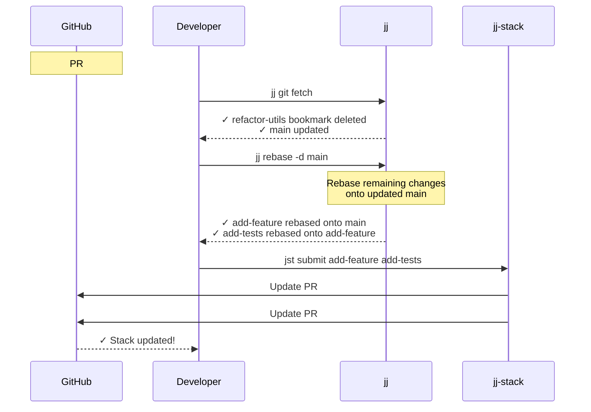

**Commands**:

```bash
# 1. After PR #123 merges on GitHub
jj git fetch
# Bookmark 'refactor-utils' is auto-deleted
# main is updated

# 2. Rebase remaining work onto main
jj rebase -d main
# add-feature now based on main
# add-tests still based on add-feature

# 3. Update remaining PRs
jst submit add-feature add-tests
# PR #124 now targets main instead of refactor-utils
# PR #125 still targets add-feature
```

### Helper Function

Use the `jclean-merged` helper:

```bash
# Does all three steps
jclean-merged

# Equivalent to:
# jj git fetch && jj rebase -d main
```

---

## Advanced Stack Patterns

### Pattern: Parallel Stacks

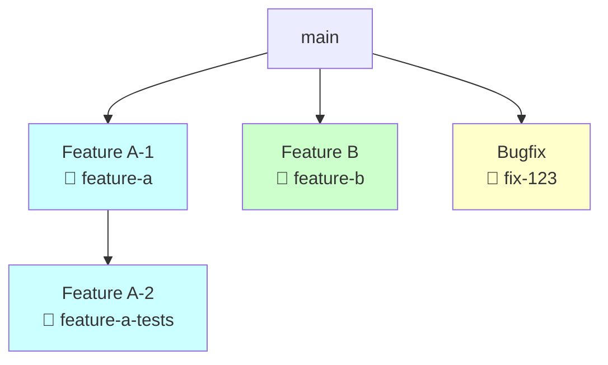

**Multiple independent stacks**:

- Stack 1: feature-a, feature-a-tests
- Independent: feature-b
- Independent: fix-123

**Submit separately**:

```bash
jst submit feature-a feature-a-tests  # Stack 1
jst submit feature-b                   # Independent
jst submit fix-123                     # Independent
```

### Pattern: Diamond Dependency

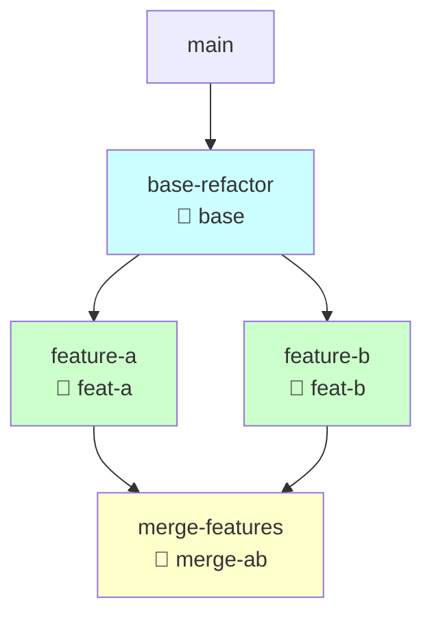

**Complex dependency**:

- base-refactor: Base change
- feature-a & feature-b: Both depend on base
- merge-features: Depends on both A and B

**Note**: jj-stack works best with linear stacks. For diamond dependencies, you may need to submit as:

```bash
jst submit base           # PR #1: base → main
jst submit feat-a         # PR #2: feat-a → base
jst submit feat-b         # PR #3: feat-b → base
# merge-ab would need manual handling
```

### Pattern: Incremental Feature Development

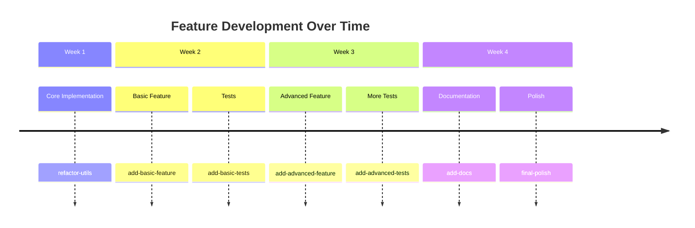

**All as one stack**:

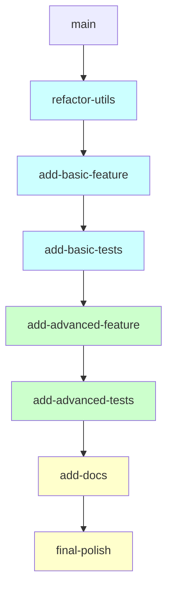

**Submit incrementally**:

```bash
# Week 1
jst submit refactor-utils

# Week 2
jst submit refactor-utils add-basic-feature add-basic-tests

# Week 3
jst submit refactor-utils add-basic-feature add-basic-tests \
           add-advanced-feature add-advanced-tests

# Week 4
jst submit refactor-utils add-basic-feature add-basic-tests \
           add-advanced-feature add-advanced-tests add-docs final-polish
```

As bottom PRs merge, rebase and re-submit remaining stack.

---

## Best Practices for Stacked Diffs

### 1. Keep Changes Focused

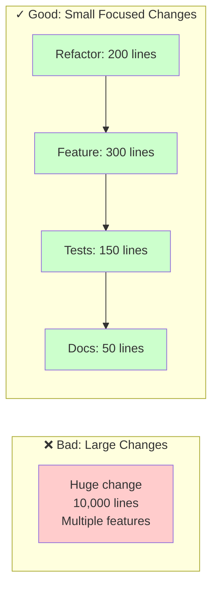

**Why**: Smaller changes are easier to review and merge faster.

### 2. Logical Ordering

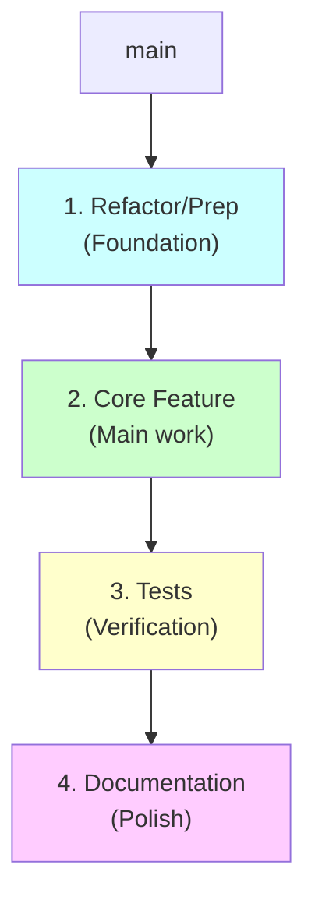

**Order**: Foundation → Feature → Tests → Docs

### 3. Meaningful Bookmark Names

```bash
# ❌ Bad
jj bookmark create fix
jj bookmark create stuff
jj bookmark create tmp

# ✓ Good
jj bookmark create refactor-user-service
jj bookmark create add-user-authentication
jj bookmark create add-auth-tests
```

### 4. Update Entire Stack

```bash
# ❌ Partial update (may cause issues)
jst submit refactor-utils

# ✓ Update entire stack
jst submit refactor-utils add-feature add-tests
```

---

## Troubleshooting Stacks

### Issue: PR Has Wrong Base

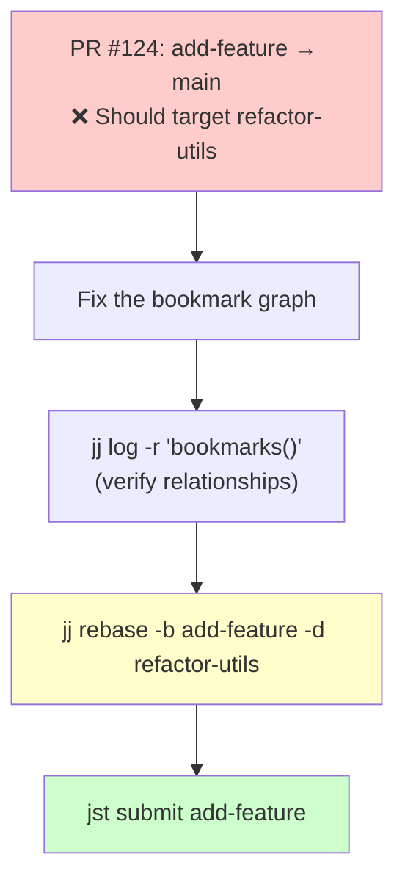

**Commands**:

```bash
# Check current structure
jj log -r 'bookmarks()'

# Fix: rebase add-feature onto refactor-utils
jj rebase -b add-feature -d refactor-utils

# Re-submit
jst submit add-feature
```

### Issue: Lost Track of Stack

```bash
# View all your bookmarks and their relationships
jj log -r 'bookmarks() & mine()'

# Or use lazyjj for visual exploration
lazyjj
```

### Issue: Conflict in Middle of Stack

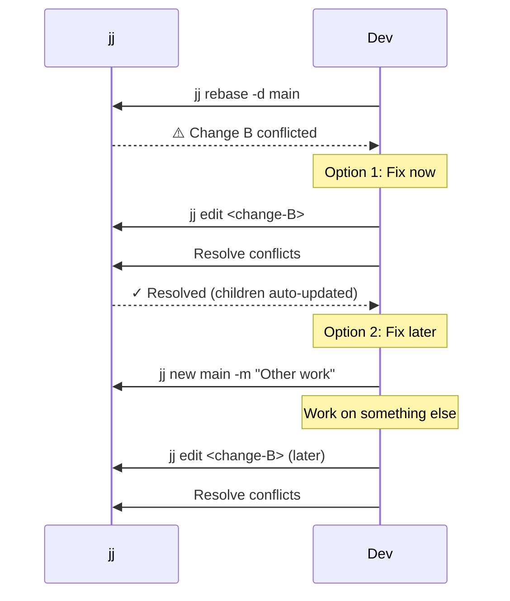

**Conflicts don't block**: Resolve when convenient.

---

## Summary: Stacked Workflow

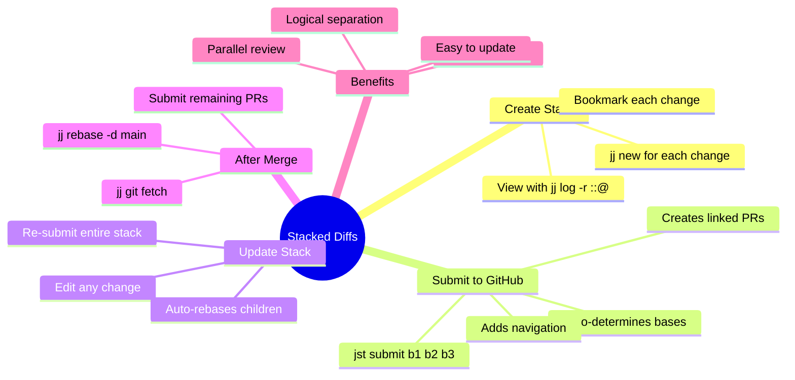

### Key Principles

1. **Build incrementally**: Stack changes as you work
2. **Bookmark before submitting**: jj-stack needs bookmarks
3. **Submit entire stack**: Use `jst submit` with all bookmarks
4. **Update atomically**: Re-submit whole stack after changes
5. **Rebase after merges**: Keep remaining PRs up to date

> "This is already an enormous upgrade compared to Git with its manual git rebase --ontos for every child PR."
>
> — [GitHub Discussion](https://github.com/jj-vcs/jj/discussions/5509)

---

## Further Reading

- [JJ_MENTAL_MODEL.md](./JJ_MENTAL_MODEL.md) - Core concepts
- [JJ_WORKFLOWS.md](./JJ_WORKFLOWS.md) - General workflows
- [JJ_DECISION_TREES.md](./JJ_DECISION_TREES.md) - Command selection guide
- [jj-stack GitHub](https://github.com/keanemind/jj-stack) - Tool documentation
- [Getting Started Guide](./JJ_GETTING_STARTED.md) - Quick start tutorial
