# Jujutsu Workflows: Visual Guide

This document shows common jj workflows and operations through visual diagrams.

## Table of Contents

- [Basic Operations](#basic-operations)
- [Stacked Changes Workflow](#stacked-changes-workflow)
- [Editing History](#editing-history)
- [Conflict Resolution](#conflict-resolution)
- [Working with Multiple Changes](#working-with-multiple-changes)
- [Integration with Git](#integration-with-git)

---

## Basic Operations

### Creating a New Change

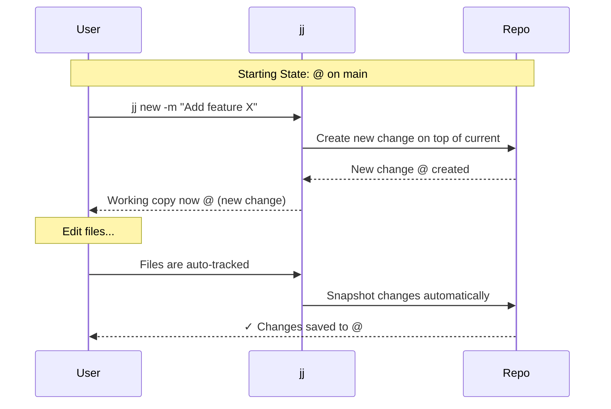

**Result**:

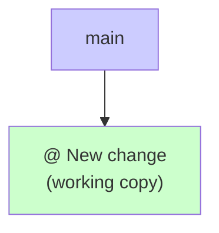

### Describing Your Work

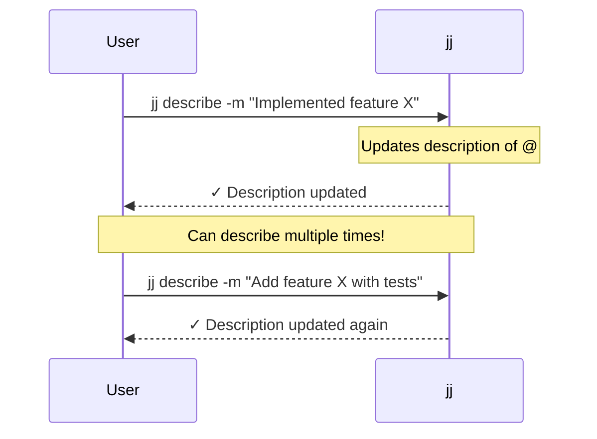

> "You can describe a change that is still 'in progress'. Describing and committing are separate operations."
>
> — [Chris Krycho](https://v5.chriskrycho.com/essays/jj-init/)

### Moving to Next Change

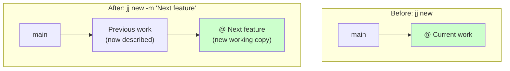

**Command**: `jj new -m "Next feature"`

**Effect**: Current work is frozen, new working copy created on top.

---

## Stacked Changes Workflow

### Building a Stack

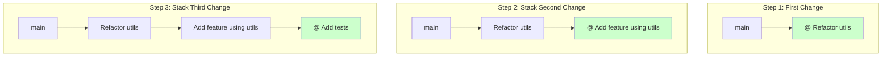

**Commands**:

```bash
# Step 1
jj new main -m "Refactor utils"
# ... edit files ...

# Step 2
jj new -m "Add feature using utils"
# ... edit files ...

# Step 3
jj new -m "Add tests"
# ... edit files ...
```

### Adding Bookmarks to Stack

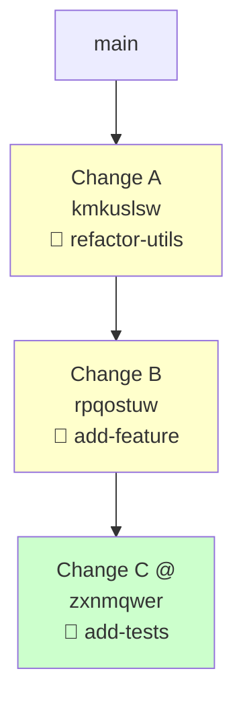

**Commands**:

```bash
jj bookmark create refactor-utils -r kmkuslsw
jj bookmark create add-feature -r rpqostuw
jj bookmark create add-tests -r @
```

### Viewing Your Stack

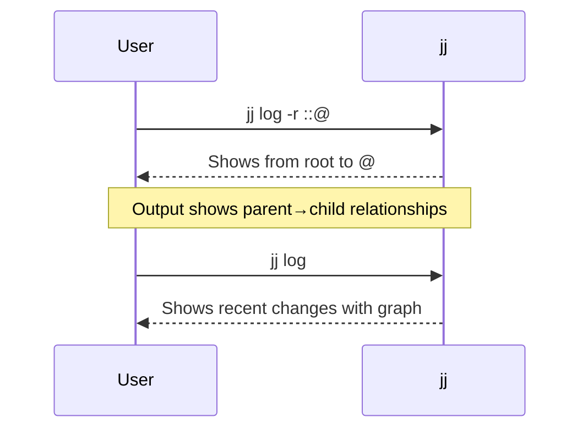

**Example Output**:

```
@  zxnmqwer kyle 2m add-tests
│  Add comprehensive tests
○  rpqostuw kyle 15m add-feature
│  Implement new feature using refactored code
○  kmkuslsw kyle 1h refactor-utils
│  Extract common utilities
○  pqrswxyz kyle 2h main
│  Previous work
```

---

## Editing History

### Editing a Change in the Middle of Stack

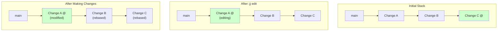

**Workflow**:

```bash
# View the stack
jj log -r ::@

# Edit change A
jj edit <change-A-id>

# Make your changes
# Files are auto-tracked

# Return to top of stack
jj edit <change-C-id>
# Or: jj new <change-C-id>
```

**What happens**: Changes B and C are automatically rebased on the modified A.

### Squashing Changes

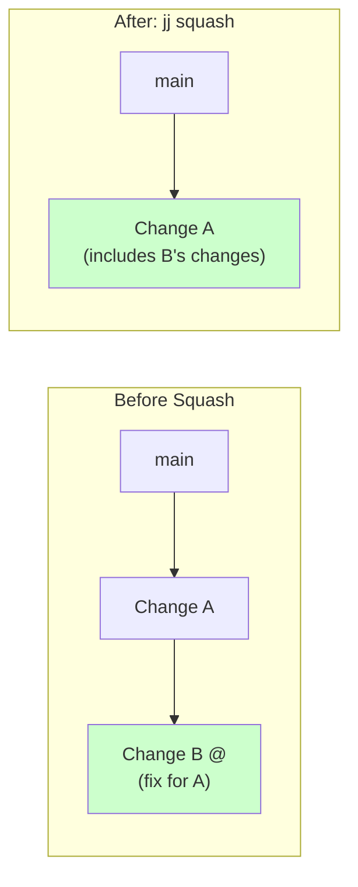

**Command**: `jj squash`

**Effect**: Current change (@) is squashed into its parent.

**Use case**: You made a fix that should be part of the previous change.

### Describing Any Change

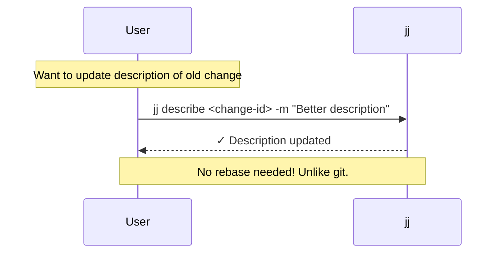

> "Rewording a message earlier in history does not involve some kind of rebase operation; you just call describe with a specific revision target."
>
> — [Chris Krycho](https://v5.chriskrycho.com/essays/jj-init/)

---

## Conflict Resolution

One of jj's unique features: conflicts don't stop your workflow.

### Git's Conflict Handling

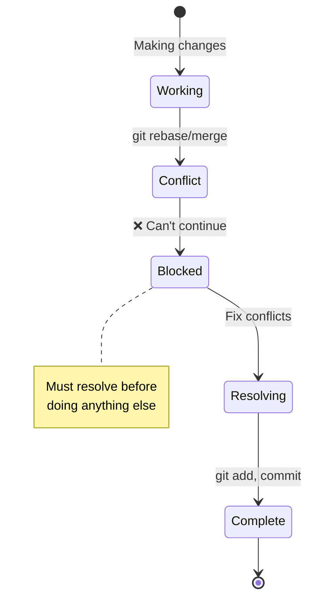

### jj's Conflict Handling

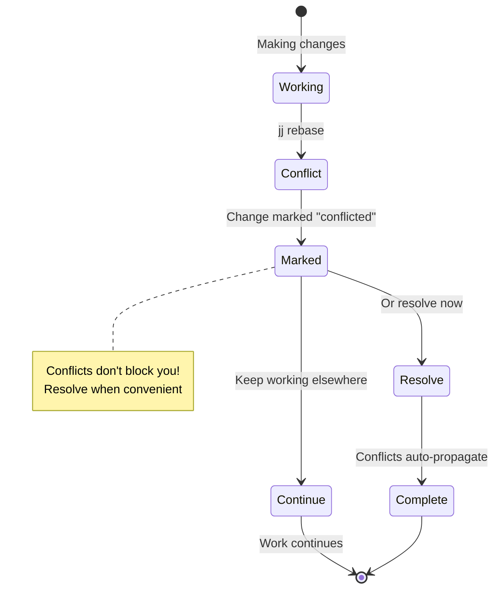

### Conflict Workflow

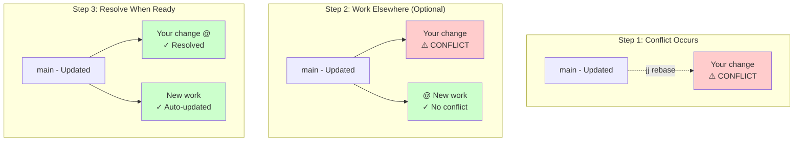

**Commands**:

```bash
# Conflict occurs during rebase
jj rebase -d main
# ⚠️ Change marked as conflicted

# Option 1: Resolve now
jj edit <conflicted-change>
# Edit files to resolve
# Auto-saved when done

# Option 2: Work elsewhere
jj new main -m "Other work"
# ... work on something else ...

# Come back later
jj edit <conflicted-change>
# Resolve conflicts
```

> "Conflicts don't halt workflow. Jujutsu marks a commit as conflicted but allows continuing work elsewhere, then returning to resolve them later with automatic cascading updates."
>
> — [Stavros](https://www.stavros.io/posts/switch-to-jujutsu-already-a-tutorial/)

---

## Working with Multiple Changes

### Parallel Work Streams

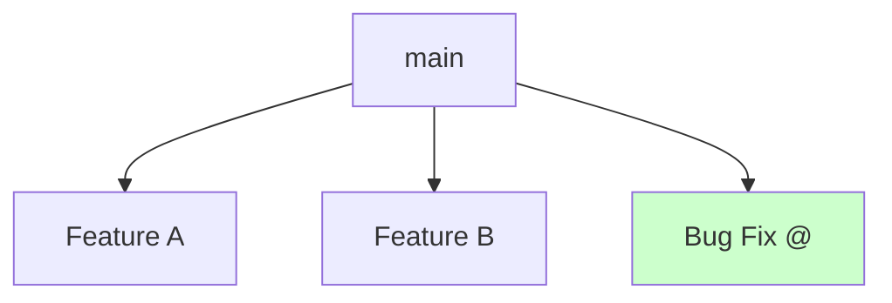

**Workflow**:

```bash
# Start feature A
jj new main -m "Feature A"
# ... work ...

# Start feature B (from main, not A)
jj new main -m "Feature B"
# ... work ...

# Start bug fix
jj new main -m "Bug fix"
# ... work ...
```

**No interference**: Each change is independent.

### Switching Between Changes

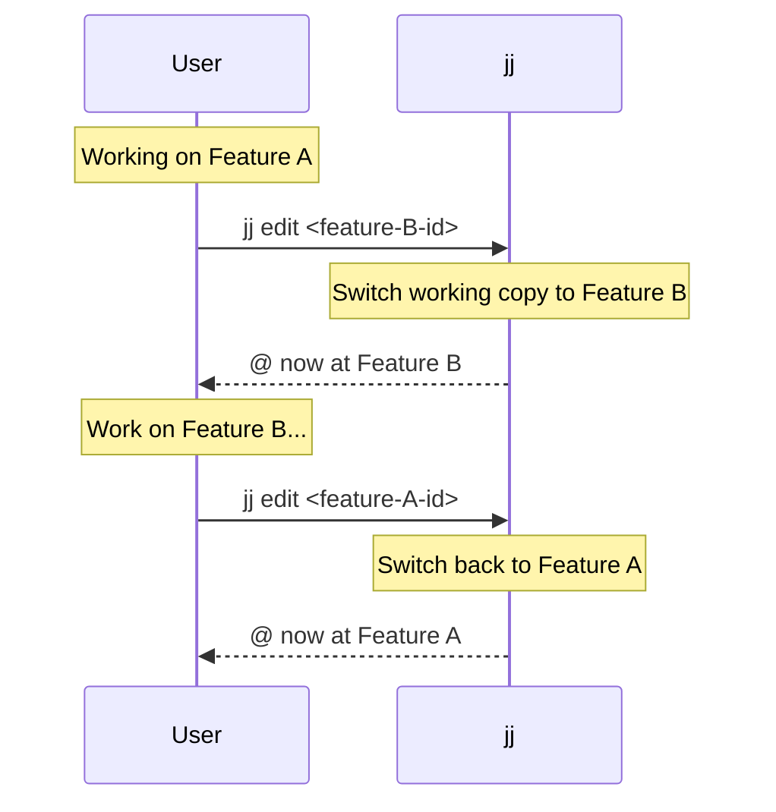

**No stashing needed**: Each change preserves its state.

### Visualizing Multiple Streams

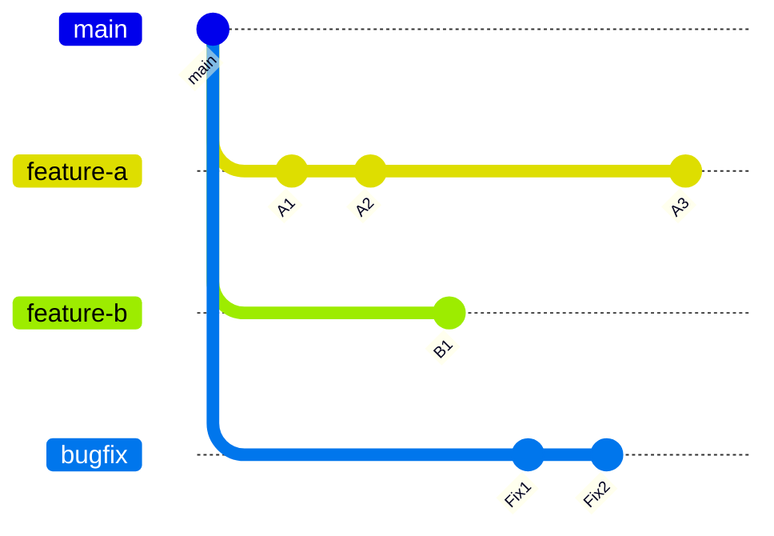

**Command to see this**: `jj log` or `lazyjj`

---

## Integration with Git

### Colocated Repository Model

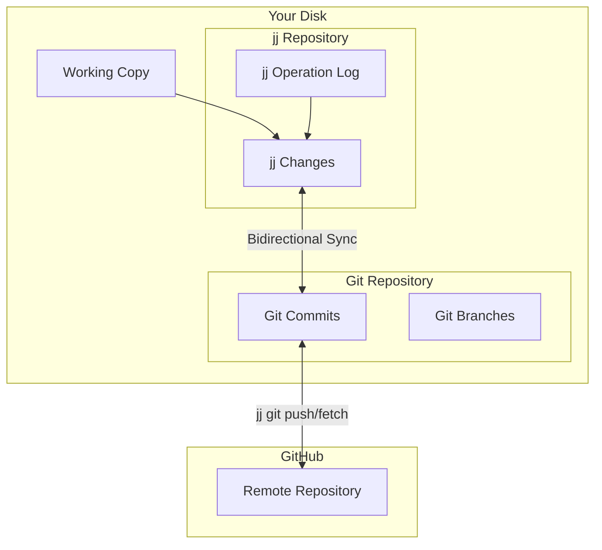

**Key Point**: jj and git coexist. Changes sync to git commits automatically.

### Push/Pull Workflow

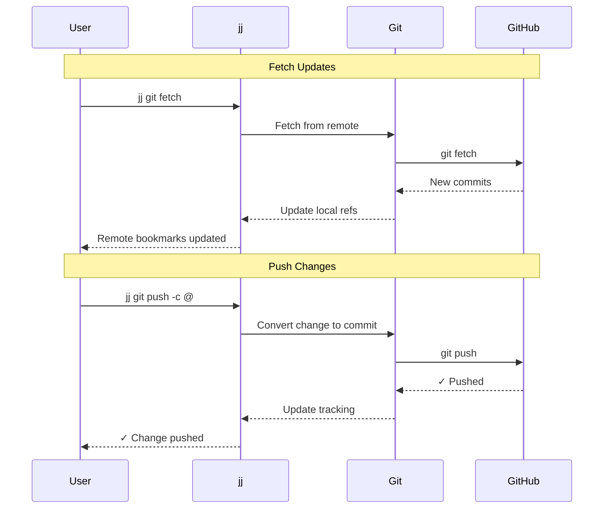

### Bookmark Synchronization

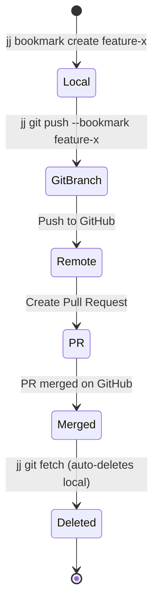

**Automatic cleanup**: When a PR is merged on GitHub, `jj git fetch` automatically removes the local bookmark.

---

## Common Patterns

### Pattern: Incremental Development

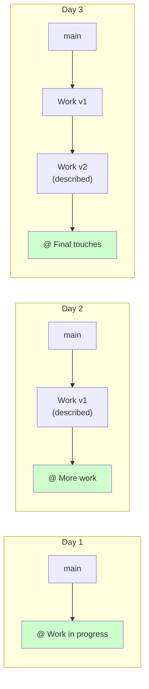

**Workflow**:

```bash
# Day 1
jj new main -m "WIP: New feature"
# ... work ...

# Day 2
jj describe -m "Implement core logic"
jj new -m "Add tests"
# ... work ...

# Day 3
jj describe -m "Add comprehensive tests"
jj new -m "Add documentation"
# ... work ...

# Ready to submit
jj bookmark create feature-x -r <first-change>
jj bookmark create feature-x-tests -r <second-change>
jj bookmark create feature-x-docs -r @
```

### Pattern: Fix Earlier Change

```mermaid
graph TB
    subgraph "Discovered Bug in Change A"
        M1[main] --> A1[Change A<br/>Has bug]
        A1 --> B1[Change B]
        B1 --> C1["Change C @"]
    end

    subgraph "Create Fix"
        M2[main] --> A2[Change A]
        A2 --> B2[Change B]
        B2 --> C2[Change C]
        C2 --> F2["@ Fix for A"]
    end

    subgraph "Squash Fix into A"
        M3[main] --> A3["Change A<br/>(with fix)"]
        A3 --> B3["Change B<br/>(rebased)"]
        B3 --> C3["Change C<br/>(rebased)"]
    end

    style C1 fill:#ccffcc
    style F2 fill:#ffffcc
    style A3 fill:#ccffcc
```

**Commands**:

```bash
# Create fix based on A
jj new <change-A> -m "Fix bug in A"
# ... make fix ...

# Squash fix into A
jj squash --into <change-A>

# Or use interactive squash
jj squash -i
```

### Pattern: Reordering Changes

```mermaid
graph LR
    subgraph "Before"
        M1[main] --> A1[A]
        A1 --> B1[B]
        B1 --> C1[C]
    end

    subgraph "After: Move C to be after main"
        M2[main] --> C2[C]
        C2 --> A2[A]
        A2 --> B2[B]
    end
```

**Commands**:

```bash
# Move change C to be on top of main
jj rebase -s <change-C> -d main

# Move change A to be on top of C (bringing B with it)
jj rebase -b <change-A> -d <change-C>
```

---

## Summary: Key Workflows

```mermaid
mindmap
    root((jj Workflows))
        Basic Operations
            jj new: Create change
            jj describe: Add message
            jj edit: Switch to change
            jj log: View history
        Stacking
            Build incrementally
            Add bookmarks for PRs
            View with jj log -r ::@
        Editing History
            jj edit: Modify any change
            jj squash: Combine changes
            jj describe: Update messages
            Auto-rebase children
        Conflicts
            Non-blocking
            Marked, not fatal
            Resolve when convenient
            Auto-propagate fixes
        Multiple Changes
            Parallel work streams
            No stashing needed
            Switch with jj edit
            Independent changes
        Git Integration
            Colocated repos
            jj git fetch/push
            Auto-sync bookmarks
            Bidirectional
```

### Workflow Principles

1. **Work incrementally**: Create small, focused changes
2. **Describe as you go**: Use `jj describe` to document intent
3. **Edit freely**: History is mutable - fix mistakes anywhere
4. **Don't fear conflicts**: They won't block you
5. **Stack naturally**: Build changes on top of each other
6. **Bookmark for PRs**: Only create bookmarks when sharing

---

## Further Reading

- [Steve's Jujutsu Tutorial](https://steveklabnik.github.io/jujutsu-tutorial/) - Hands-on workflows
- [Stavros: Switch to Jujutsu Already](https://www.stavros.io/posts/switch-to-jujutsu-already-a-tutorial/) - Practical patterns
- [jj Official Docs](https://jj-vcs.github.io/jj/) - Comprehensive reference

**Next**: See [JJ_DECISION_TREES.md](./JJ_DECISION_TREES.md) for decision-making guides and [JJ_STACKED_WORKFLOW.md](./JJ_STACKED_WORKFLOW.md) for jj-stack specific workflows.
