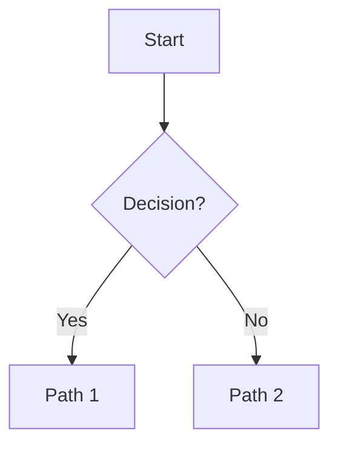
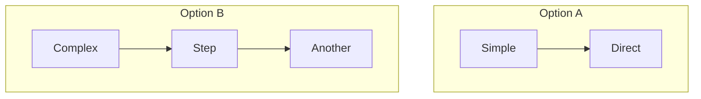

# Document Writing Guide

Create technical documents that are concise, scannable, and appropriately formatted for a technical audience.

**Document request:** "$ARGUMENTS"

## Voice and Tone

### Core Characteristics

- **Conversational technical**: Approachable but precise; occasional personality without sacrificing accuracy
- **Opinionated with context**: Make clear recommendations, but explain the tradeoffs
- **Direct**: Assume reader competence; get to the point without excessive preamble
- **Active voice**: Prefer active constructions over passive

### Patterns to Avoid

- **Filler phrases**: "It's worth noting", "As you can see", "Simply put", "In order to"
- **Over-hedging**: Don't write "might perhaps potentially" when you mean something definite
- **Unnecessary preamble**: Skip lengthy introductions; start with the substance
- **False precision**: Avoid implying exactness where none exists

### Patterns to Follow

- Lead with the key insight or recommendation
- Trust the reader to extrapolate from minimal examples
- Link to real-world citations, blogs, or papers when they add value
- Let technical content speak without excessive commentary

## Document Structure

### Overall Organization

Choose structure based on content:

1. **BLUF/TLDR (top-down)**: Start with summary/conclusion, then supporting details. Use for most technical docs.
2. **Problem-Solution**: State the problem clearly, then walk through the solution. Use for guides and troubleshooting.

Keep documents **concise and scannable**. Brevity respects the reader's time. When depth is needed, use dedicated subsections, diagrams, or tables rather than inline expansion.

### Section Hierarchy

- Use headers generously for navigation, but don't overdo nesting
- H2 for major sections, H3 for subsections
- Avoid going deeper than H4; restructure if needed
- Each section should be independently scannable

## Format Selection

### When to Use Prose Paragraphs

- Philosophy and conceptual explanations ("why" something matters)
- Narrative context that flows naturally
- Synthesizing multiple related points into a cohesive argument
- When the density of information is low enough for linear reading

### When to Use Bullet Lists

- Action items and steps
- Sequences or ordered processes
- Unordered sets of discrete items
- When items are short and benefit from visual separation

### When to Use Tables

- Comparing items across **2+ consistent dimensions**
- Dense information that benefits from alignment
- Reference material readers will scan/search
- Truly tabular data with clear rows and columns

Avoid tables for:
- Simple lists that could be bullets
- Prose content forced into cells
- Visual links or resource lists (use annotated lists instead)

### When to Use Diagrams

Use diagrams sparingly. They add value when:

1. **Relationships and flow**: Connections, sequences, or decision trees that are hard to describe linearly
2. **Complex comparisons**: Contrasting multiple options with branching logic
3. **Structural concepts**: Architecture or hierarchy where spatial arrangement conveys meaning

Skip diagrams when text suffices. A simple concept doesn't need a visual.

### Diagram Types

**Flowcharts**: Decision trees with branching logic


**C4-style architecture** (adapt level to context):
- **L1 Context**: System in its environment; users and external systems
- **L2 Container**: High-level tech choices; apps, databases, services
- **L3 Component**: Internal structure; modules and classes

Choose 1-2 levels situationally. Common combinations: L1+L3, L2+L3, L2 only, L3 only. Pure L1 is rarely sufficient alone.

Use standard Mermaid graph syntax; avoid the underdeveloped Mermaid C4 format.

**Comparison diagrams**: Side-by-side subgraphs showing structural differences



## Formatting Conventions

### Text Formatting

- **Bold** for key terms or critical concepts (use sparingly)
- `code blocks` for commands, file names, code, technical identifiers
- Avoid italics and underlining; keep formatting minimal
- Let content speak; formatting should be invisible

### Code Blocks

Use fenced code blocks with language hints:
```python
def example():
    pass
```

### Links and References

- Inline links for essential references: `[text](url)`
- For curated resource lists, use annotated bullet lists or simple tables
- Prefer paragraphs or lists over tables for link collections

## Workflow

1. **Clarify scope**: Understand document type, audience, and purpose
2. **Outline structure**: Choose BLUF or Problem-Solution; sketch sections
3. **Draft content**: Write concisely; prefer prose for concepts, lists for actions
4. **Add visuals**: Diagrams only where they add value beyond text
5. **Review**: Check for filler, passive voice, unnecessary hedging
6. **Polish**: Ensure scannability; verify header hierarchy

## Examples by Document Type

### Technical Guide
- BLUF structure with key takeaway first
- Problem-Solution subsections
- Code examples where essential
- Resource links at end

### API/Reference Documentation
- Tables for parameters, options, comparisons
- Code blocks for usage examples
- Minimal prose; scannable format

### Architecture Document
- C4 diagrams at appropriate level(s)
- Prose for rationale and tradeoffs
- Tables for technology choices

### Decision Document
- Problem statement first
- Options as subsections or comparison table
- Clear recommendation with reasoning
